

scikit-image

From 0.20 to 2.0

 
 
 
 

Stéfan van der Walt 
University of California, Berkeley

Notes:

- Excited to be here
- 2016 to now
<!--

We are especially interested in major challenges you
face when performing image analysis, any training efforts you do to
transfer the skills of image analysis, and the computational tools
(software, data structures, packages, workflows) you develop or rely
on in your research.

Talk is 20 minutes.

-->
...

*Computed tomography in use on this lane* — sign at Reno-Tahoe airport

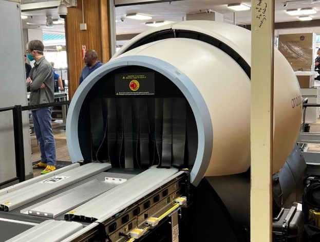

Notes:

Saw sign in airport
This was how I got into image processing!
Ability to see inside an object without cutting it open 🤯

...

  

> scikit-image is a collection of **algorithms** for **image processing** written **in Python**. It is available free of charge and **free of restriction**. We pride ourselves on high-quality, peer-reviewed code, written by an active **community** of volunteers.

Notes:

- What is skimage?
- Explain why it exists
- The tool we would have wanted during PhD

...

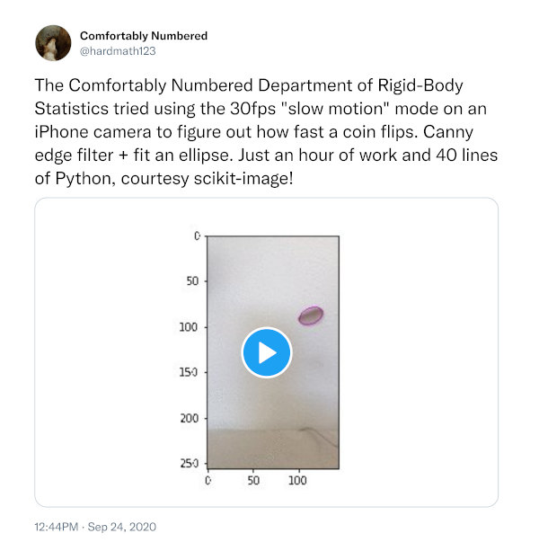

https://twitter.com/hardmath123/status/1309217036925501441 
https://twitter.com/hardmath123/status/1309217472176742401

Notes:

- Why did I build it? To be the tool I would have wanted to have around during my PhD.
- Many algorithms from mailing list. Others from PhD work.

...

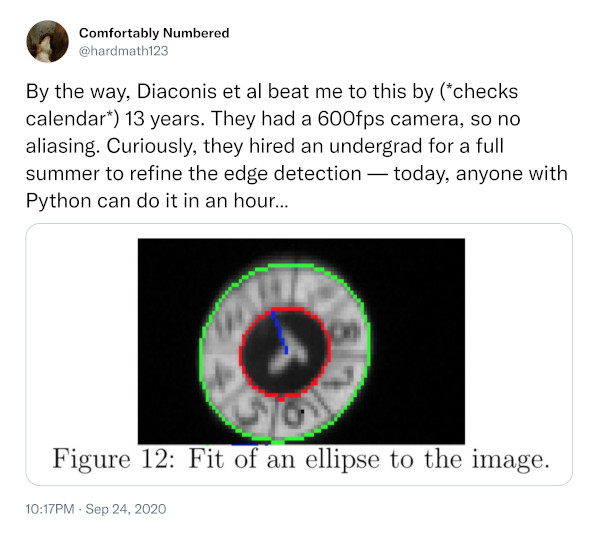

https://twitter.com/hardmath123/status/1309217036925501441

Notes:

- This is what we wanted to enable.
- By providing basic building blocks so researchers could focus on their ideas.

...

### Community ethos

> We welcome each and every contributor to scikit-image. Our aim is enthusiastic and productive collaboration, to build an excellent software library, and to have a ton of fun doing it. We encourage one another to be gentle in criticism of others’ work, humble in acknowledging our own mistakes, and generous in our praise.

<b>Community driven open source is as much about people as it is
about software.</b>

...

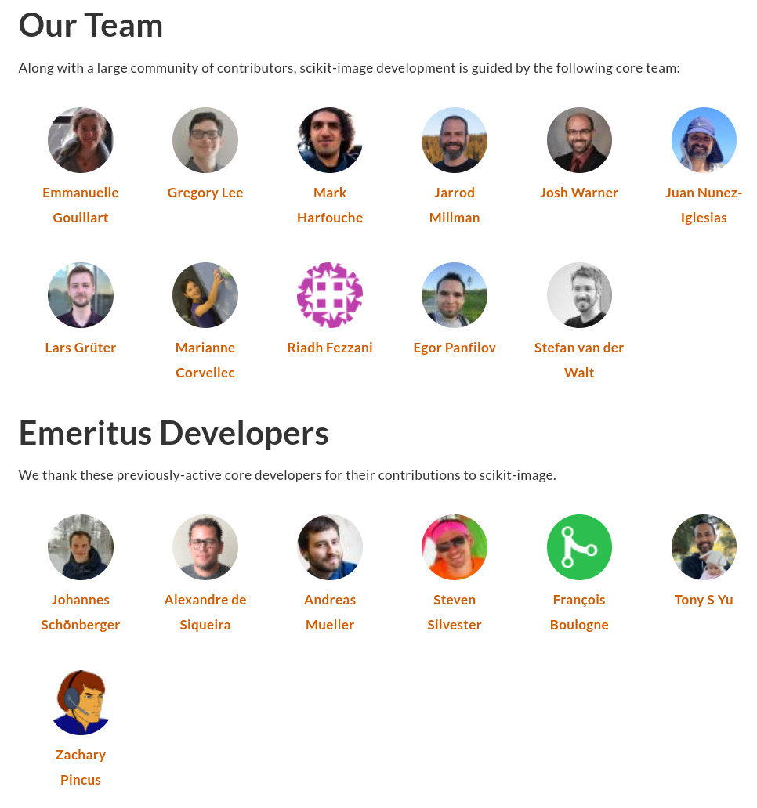

...

### The library is part of an ecosystem

    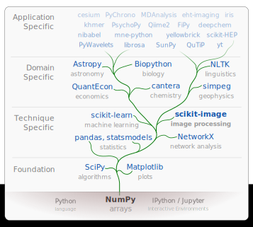

---

## What is `skimage` used for?

...

    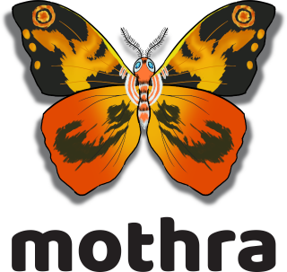
    

    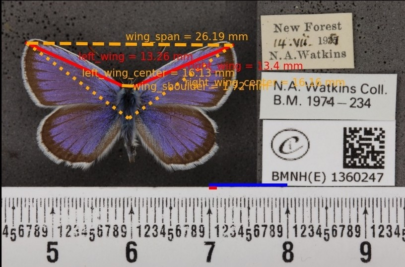

    https://www.britishecologicalsociety.org/natural-history-museums-digitised-collections-reveal-impact-of-climate-change-on-british-butterflies/

...

  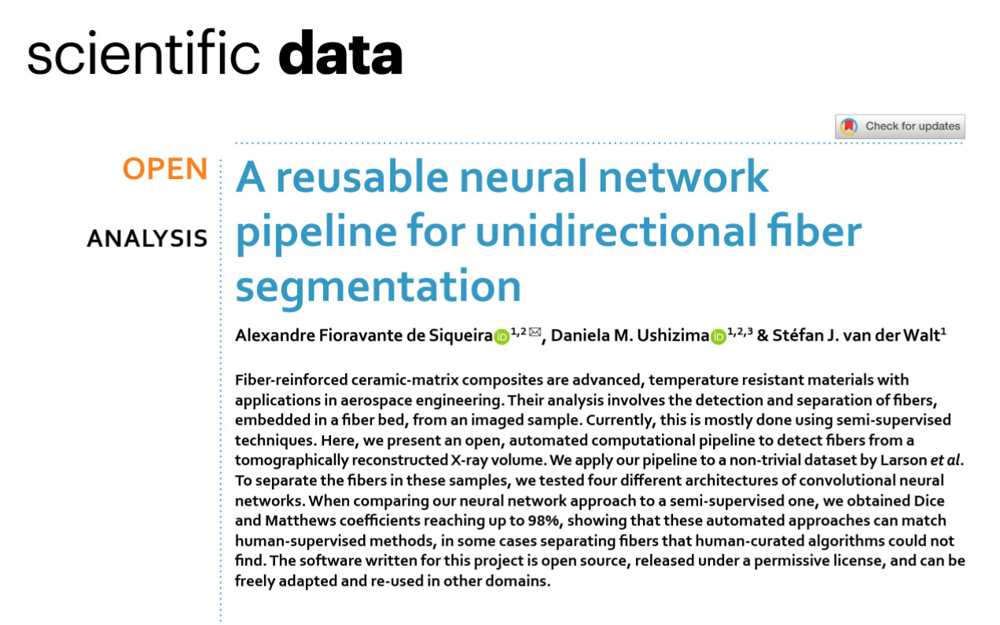

...

  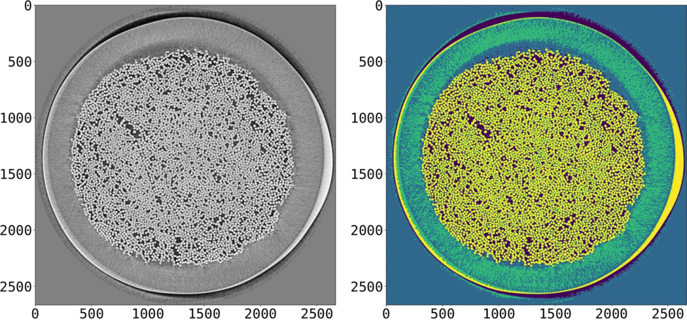
  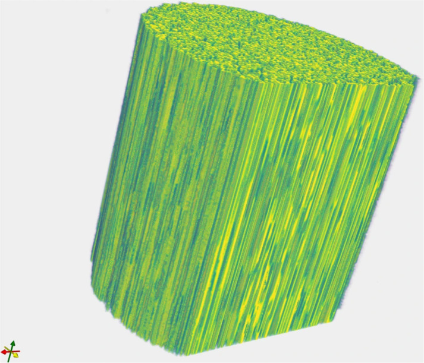

...

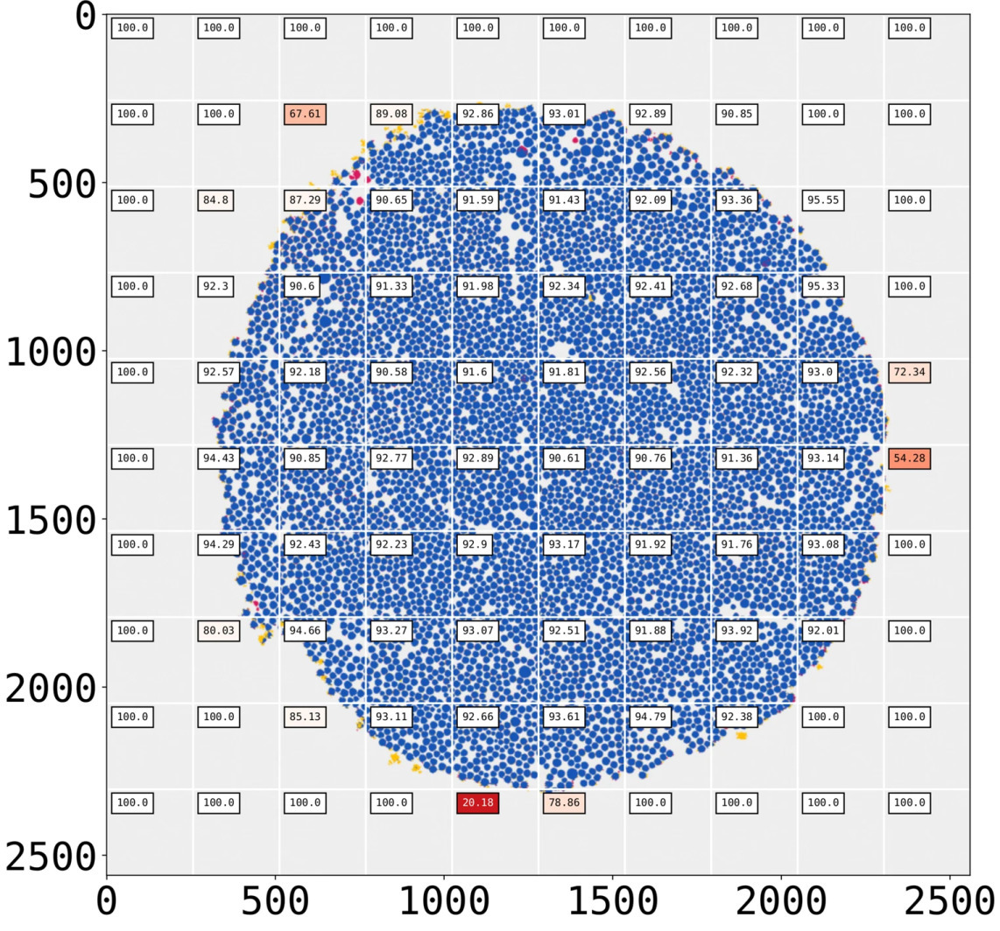

  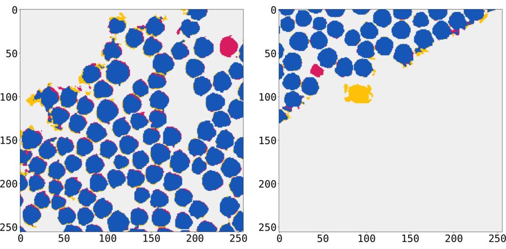

  Bizarrely, we neglected to cite <tt>numpy</tt> and <tt>scikit-image</tt> 🙈

   
  Got to pay attention to software citations!

...

`scikit-image` is also used in

astronomy, microscopy, chemistry, physics, earth & climate science, medicine, remote sensing ...

...

### And then there's... this.

    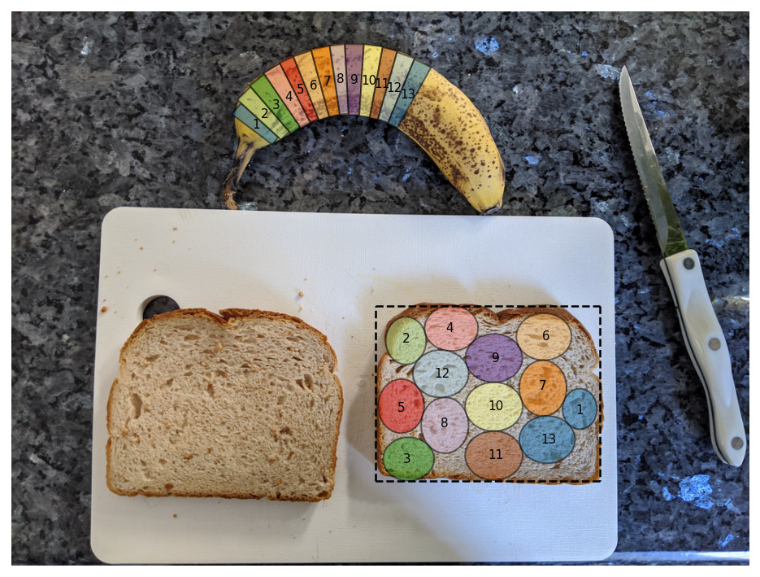

https://www.ethanrosenthal.com/2020/08/25/optimal-peanut-butter-and-banana-sandwiches/

---

## 0.20 — released!

71 authors, 42 reviewers, 275 pull requests merged!

- Anisotropic images in `skimage.measure`
- Performance improvements, e.g. footprint decomposition in `skimage.morphology`
  
- More N-dimensional support
- More consistent API, including `channel_axis` for indicating multi-channel images
- New build system: Meson

...

## skimage 2.0

Motivation:

- Organic API growth over a decade
  - Harmonization of concepts such as random seed
- Early design decisions
  - Data type range inferral
  - `transform` module coordinate convention
- Operations on non-NumPy array containers

[SKIP3](https://scikit-image.org/docs/stable/skips/3-transition-to-v1.html), [SKIP4](https://scikit-image.org/docs/stable/skips/4-transition-to-v2.html)

...

## A pragmatic pathway

[A Pragmatic Pathway Towards skimage2](https://discuss.scientific-python.org/t/a-pragmatic-pathway-towards-skimage2/530/24)

Principles for a transition (my opinion):

1. Do not estrange your existing user base.
2. Ensure transitioning of majority of users.
3. Do not place an undue burden on maintainers.
4. Initially, allow using old and the new APIs in conjunction.

A potential route:

1. Release `skimage2` (still distributed as pip install `scikit-image`).
2. This package contains both `skimage` and `skimage2` libraries.
3. Over time, deprecate the functions in `skimage` with instructions.
4. Eventually remove `skimage`, with instructions.

Notes:

- Do not want to estrange a large part of our existing user base. This implies making any porting of code straightforward (a challenge with the Py 2 to 3 port was that you had to read and think about the code you were porting; it was not just a matter of applying certain prescribed recipes).

- Ensure that most users eventually land on skimage2. If, e.g., we provided a supported skimage1 and skimage2, there would be no incentive to transition.

- Do not place an undue burden on maintainers. This would, e.g., preclude long term support of both skimage1 and skimage2.

- Initially, allow users to use the old and the new APIs in conjunction (this should help greatly in porting code).

---

## Challenges

...

### Software development in academia (I)

- Lacking credit & evaluation (still papers)
- Few suitable academic positions

Despite:

- Impact
- Better science
  - User-developers
  - Science more transparent, reproducible, verifiable
  - Open work often more collaborative

...

#### Software development in academia (II)

You can help:

- Contribute or support students who want to contribute
- Reward and recognize efforts outside of paper writing
- Fund open, not closed software (and convince the NSF/NIH/... to do the
  same!)
- Apply lessons from open source computational research software to your work:
  1. Test research code
  2. Executable papers (AKA automate everything)
  3. Collaborate widely, credit all those involved
  4. Insist on open code & data (reviewing and publishing)

*Developing open source scientific practice*, K. Jarrod Millman & Fernando Pérez 
https://www.jarrodmillman.com/oss-chapter.html

...

### Sustained support

**CZI EOSS (Cycle 5)**

- [skimage 2.0 API transition, types, and maintenance grant](https://chanzuckerberg.com/eoss/proposals/from-library-to-protocol-scikit-image-as-an-api-reference/)
  - Outreachy Internships
    - Projects:
      1. Enhance image warping in scikit-image with thin-plate spines
      2. Expand scikit-image gallery with biomedical examples (narrative documentation)
    - Currently in contribution period
    - Interns announced May 4th; internship from May 29th to August 25th

**Scientific Python**

Release management & maintenance

**Tidelift**

Which other mechanisms are available?

---

## Scientific Python

> The **Scientific Python project** aims to better coordinate the
> ecosystem and grow the community.

Immediate goals:

1. Coordinate (e.g., SPECs, discussion forums)
2. Support & develop shared infrastructure (`yaml2ics`, `devpy`, ...)
3. Get projects funded
4. Foster the next generation of contributors

...

## pyOpenSci.org

https://www.pyopensci.org/get-involved-contact.html

> pyOpenSci builds diverse community around scientific open source software through open peer review, training, and mentorship

**Open peer review of Python scientific software provides:**

- Increase discoverability of high quality, maintained tools
- A supportive community for maintainers
- Guidance on packaging best practices
- Credit for developing software (via traditional mechanisms)

**Python packaging guidance**

- [Packaging guide for modern packaging best practices](https://www.pyopensci.org/python-package-guide/)
- [Forum for asking packaging questions](https://pyopensci.discourse.group/)
- Tutorials & training on the above best practices

**Build diverse community through mentorship & training**

---

## 👋

**https://scikit-image.org**

Visit the [gallery](https://scikit-image.org/docs/stable/auto_examples/), **user forum**, or **developer forum**.

https://forum.image.sc/tag/scikit-image ⬅ originated with biology community, all tools

- **Email:** stefanv@berkeley.edu
- **Mastodon:** [@stefanv@emacs.ch](https://emacs.ch/@stefanv)
- **Twitter:** [@stefanvdwalt](https://twitter.com/stefanvdwalt)
