

The Scientific Python Project

<a href="url">https://scientific-python.org</a>
 

 
 
 
 

K. Jarrod Millman 
University of California, Berkeley

...

 Scientific Python is 

 

an **ecosystem** of Python packages for scientific research and data analysis

a **community** of developers, maintainers, and users of tools in the ecosystem

a **project** to better coordinate the ecosystem and grow the community

...

## History

 

### 1990&ndash;2000

Python introduced. Matrix-SIG, numeric, and early adopters.

### 2000&ndash;2010

Numarray/numeric/numpy/scipy and a growing ecosystem of tools
driven by individual volunteer efforts and needs.

### 2010&ndash;2020

Individual projects adopt governance structures,
development processes, and roadmaps.
Wide-spread adoption of scientific Python ecosystem packages by
academia and industry.

### 2020&ndash;2030

Use of scientific Python ecosystem is pervasive.
It is being used in novel and leading science.
It is continually improving, growing, responding to needs.

---

<!-- Section: SP project -->

 Scientific Python

 
 
 
 

Introduction

...

## https://scientific-python.org/

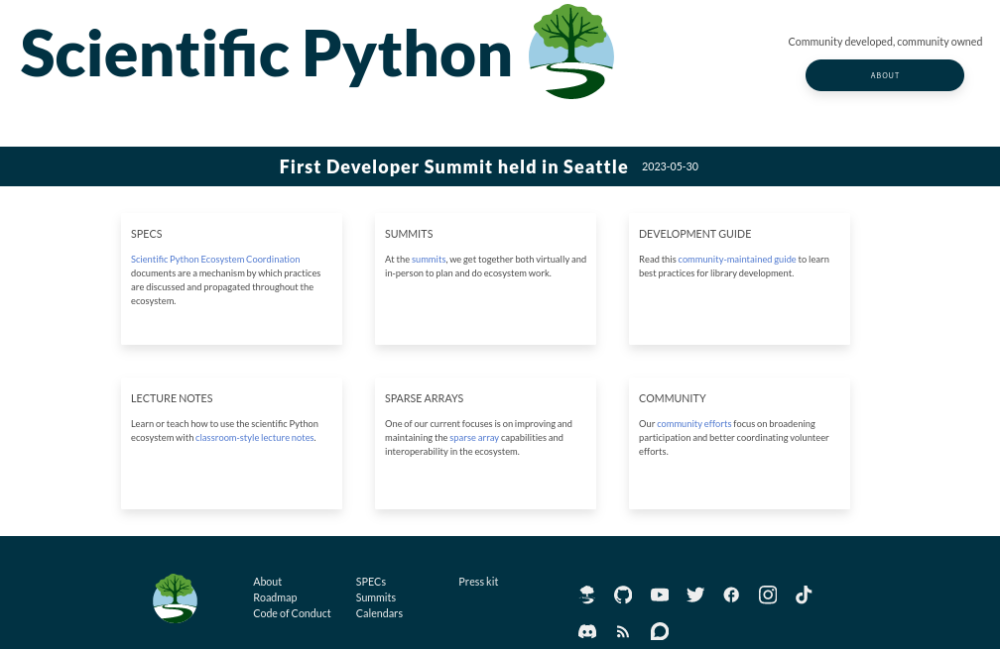

...

## Ecosystem Projects

- **Science focused**

  Tools used by students, researchers, and scientists for teaching and discovery that are openly shared with the public.

- **Open source**

  Distributed under unrestrictive open source licenses, projects are developed and maintained publicly and accessible to all.

- **Community-driven**

  Projects are developed by open communities composed primarily of the users of the software.

...

## Community Managers

---

<!-- Section: SP project -->

 Scientific Python

 
 

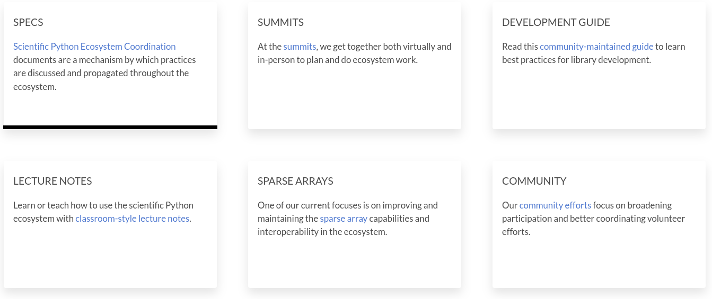

...

...

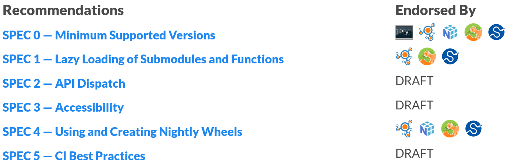

...

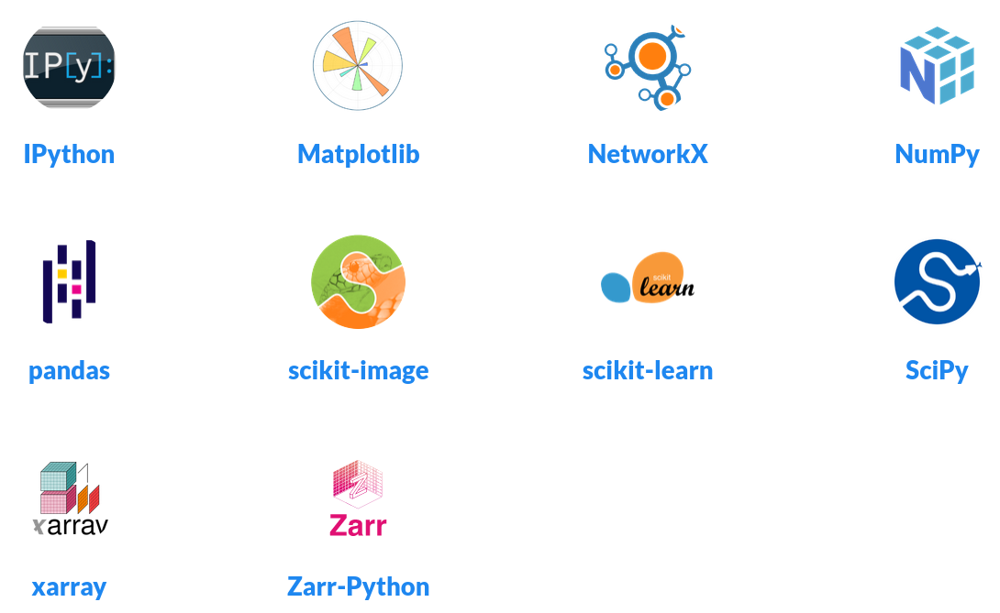

...

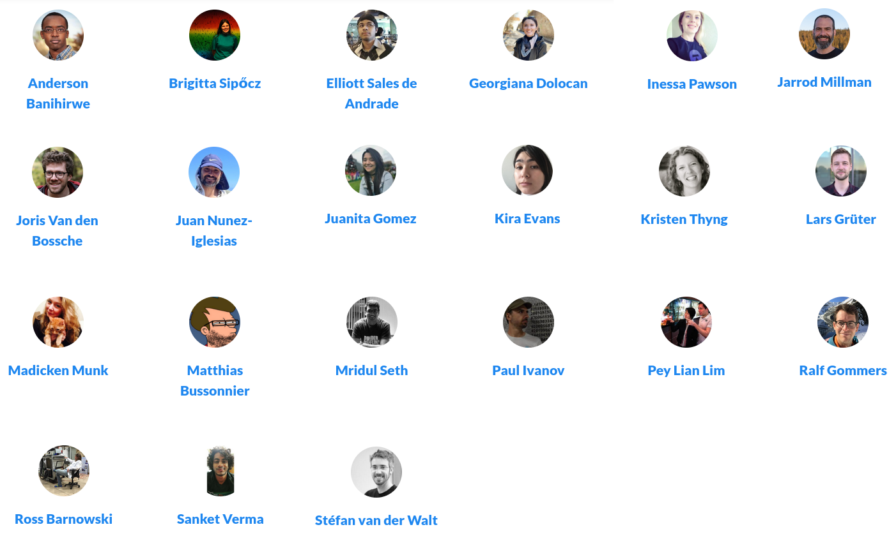

...

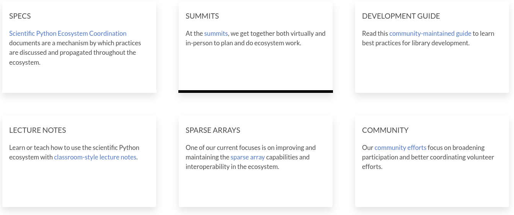

...

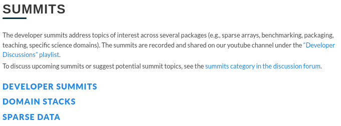

...

...

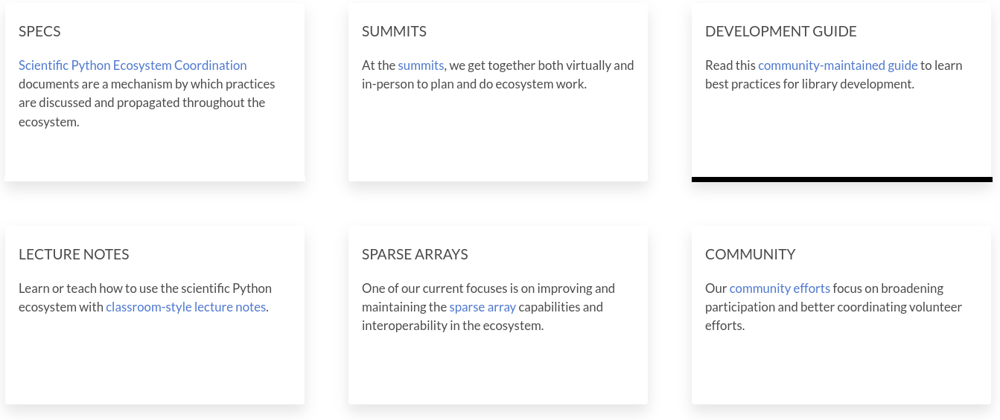

...

## https://learn.scientific-python.org/development/

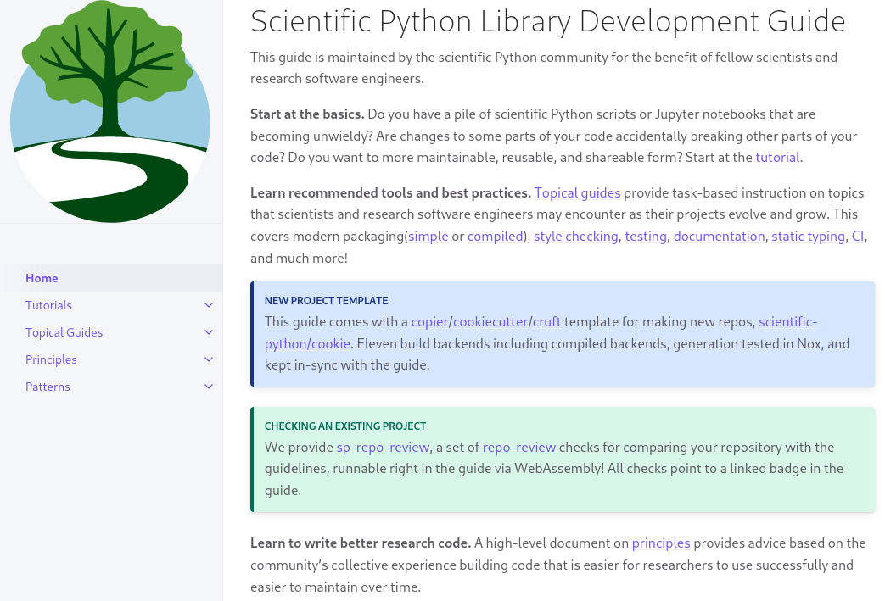

...

## https://learn.scientific-python.org/development/guides/repo-review/

...

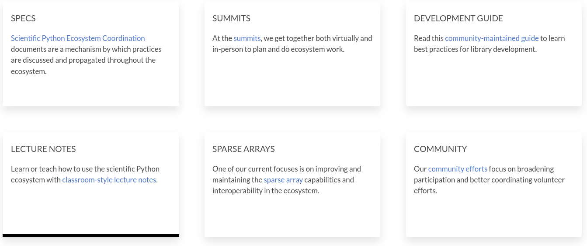

...

...

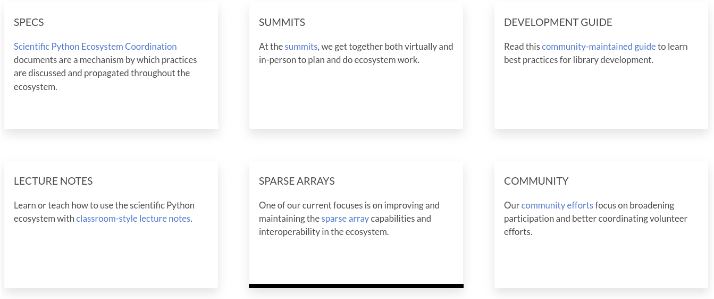

...

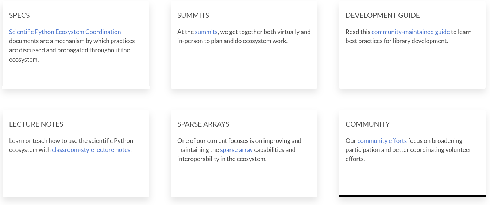

...

## Foster the next generation of contributors

 
 

...

## People

\+ &nbsp; `  {accessiblity, spec, theme, blog, ...} teams`

...

- https://twitter.com/scientific_py
- https://tinyurl.com/scientific-python-youtube

Notes:

  - Make it easy for new contributors to join the project
  - Social media
    - Onboarding
    - Dev interviews
    - SP library examples
  - Learn: material for users, contributors, maintainers
  - Blog: informal
  - Discourse discussion forum

...

---

<!-- Section: SP project -->

 Scientific Python

 
 
 
 

What you can do

Notes:

...

## Support

- Contribute or support students who want to
- Reward and recognize efforts outside of paper writing
- Fund open, not closed software (and convince funders to do the
  same!)
- Apply lessons from SP to your work
  1. Test research code
  2. Executable papers (AKA automate everything)
  3. Collaborate widely, credit all those involved
  4. Insist on open code & data (reviewing and publishing)

*Developing open source scientific practice* 
K. Jarrod Millman & Fernando Pérez 
https://www.jarrodmillman.com/oss-chapter.html

...

...

### Benefits for Contributors

- Advance science
- Make an impact
- Grow as a developer
- Shape the tools you use

You are very welcome to join!

...

### Learn more

#### Website: https://scientific-python.org

 

Has links to:

- Blog: https://blog.scientific-python.org
- Twitter: https://twitter.com/scientific_py
- YouTube: https://tinyurl.com/scientific-python-youtube
- Discourse: https://discuss.scientific-python.org
