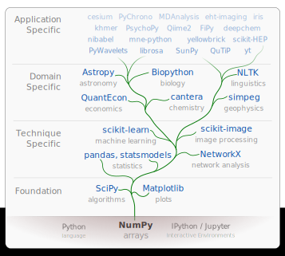
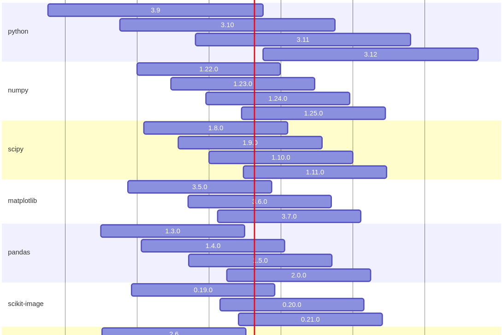
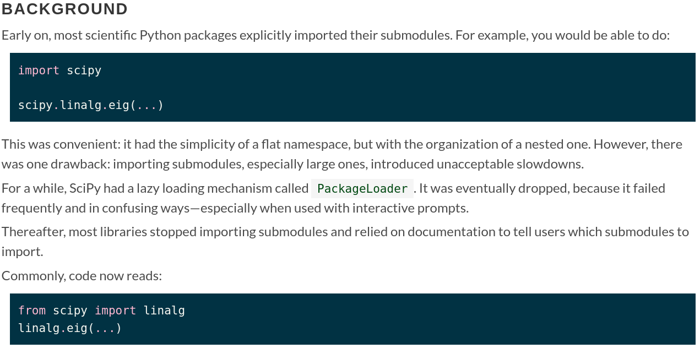
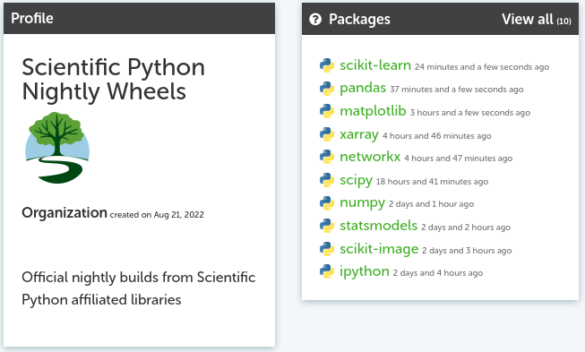
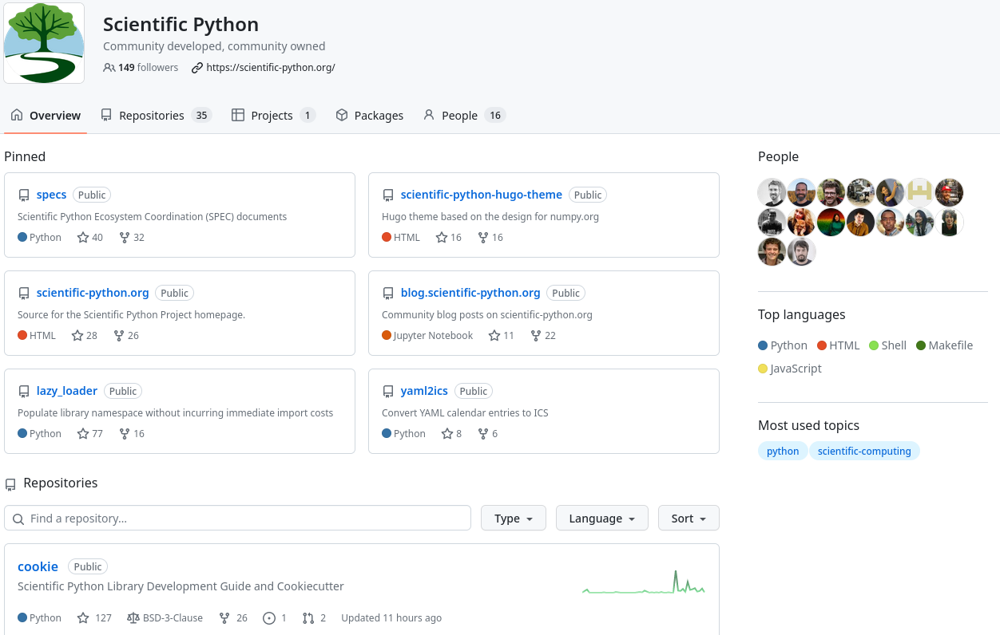
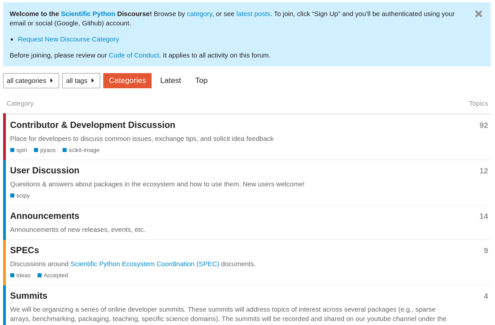
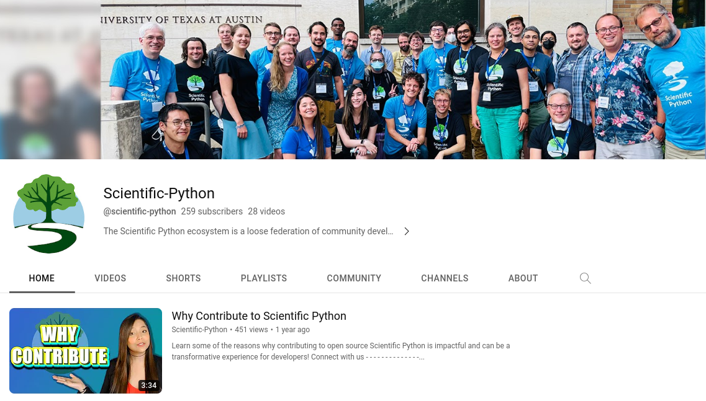
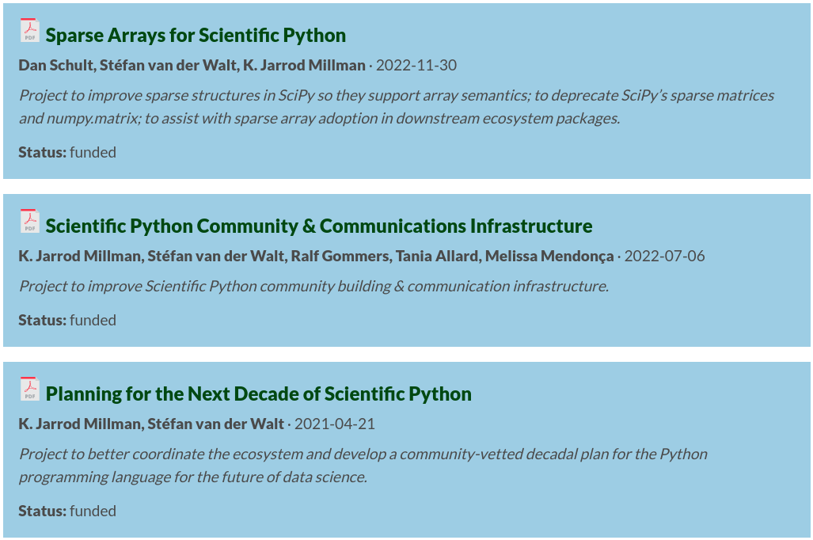

The Scientific Python Project

<a href="url">https://scientific-python.org</a>
 

 
 
 
 

K. Jarrod Millman 
University of California, Berkeley

---

<!-- Section: SP project -->

 Scientific Python

 
 
 
 

Background and introduction

...

 Scientific Python is 

 

an **ecosystem** of Python packages for scientific research and data analysis

a **community** of developers, maintainers, and users of tools in the ecosystem

a **project** to better coordinate the ecosystem and grow the community

...

### 1990&ndash;2000

Python introduced. Matrix-SIG, numeric, and early adopters.

### 2000&ndash;2010

Growing ecosystem of tools driven by individual volunteer
efforts and needs.

### 2010&ndash;2020

Wide-spread adoption of scientific Python ecosystem packages by
academia and industry.

### 2020&ndash;2030

Use of scientific Python ecosystem is pervasive.
It is being used in novel and leading science.

...

    

...

#### https://scientific-python.org/

---

<!-- Section: SP project -->

 Scientific Python

 
 

...

#### https://scientific-python.org/specs/

 

Scientific Python Ecosystem Coordination documents provide operational guidelines. 

 

...

## SPEC Core Projects

...

## SPEC Steering Committee

...

## SPEC 0 — Minimum Supported Versions 

...

## SPEC 1 — Lazy Loading of Submodules and Functions

...

## SPEC 4 — Using and Creating Nightly Wheels

---

<!-- Section: SP project -->

 Scientific Python

 
 

...

## First Scientific Python Developer Summit

...

## First Scientific Python Developer Summit

- https://scientific-python.org/summits/developer/2023/
- https://blog.scientific-python.org/scientific-python/dev-summit-1/

---

<!-- Section: SP project -->

 Scientific Python

 
 

...

#### https://learn.scientific-python.org/development/

...

#### https://learn.scientific-python.org/development/guides/repo-review/

---

<!-- Section: SP project -->

 Scientific Python

 
 

...

#### https://lectures.scientific-python.org/

 
 

...

#### https://lectures.scientific-python.org/

---

<!-- Section: SP project -->

 Scientific Python

 
 

...

## Sparse Arrays for Scientific Python

 

- improve sparse structures in SciPy so they support array semantics
- deprecate SciPy’s sparse matrices and numpy.matrix
- assist with sparse array adoption in downstream ecosystem packages

 
 
 
 

### More information

- https://scientific-python.org/grants/sparse_arrays/
- https://scientific-python.org/summits/sparse/
- https://scientific-python.org/calendars/
- https://blog.scientific-python.org/scientific-python/dev-summit-1-sparse/

...

#### https://scipy.github.io/devdocs/reference/sparse.html 

---

<!-- Section: SP project -->

 Scientific Python

 
 

...

#### https://github.com/scientific-python/

...

#### https://discuss.scientific-python.org/

...

#### https://discord.com/invite/vur45CbwMz

 
 

...

#### https://blog.scientific-python.org/

...

#### https://www.youtube.com/@scientific-python

---

<!-- Section: SP project -->

 Scientific Python

 
 
 
 

Conclusion

...

## Support

- Contribute or support students who want to
- Reward and recognize efforts outside of paper writing
- Fund open, not closed software (and convince funders to do the
  same!)
- Apply lessons from SP to your work
  1. Test research code
  2. Executable papers (AKA automate everything)
  3. Collaborate widely, credit all those involved
  4. Insist on open code & data (reviewing and publishing)

*Developing open source scientific practice* 
K. Jarrod Millman & Fernando Pérez 
https://www.jarrodmillman.com/oss-chapter.html

...

### Benefits for Contributors

- Advance science
- Make an impact
- Grow as a developer
- Shape the tools you use

You are very welcome to join!

...

#### https://scientific-python.org/grants/

...

### Learn more

#### Website: https://scientific-python.org

 

Has links to:

- Blog: https://blog.scientific-python.org
- Twitter: https://twitter.com/scientific_py
- YouTube: https://youtube.com/@scientific-python
- Discourse: https://discuss.scientific-python.org
