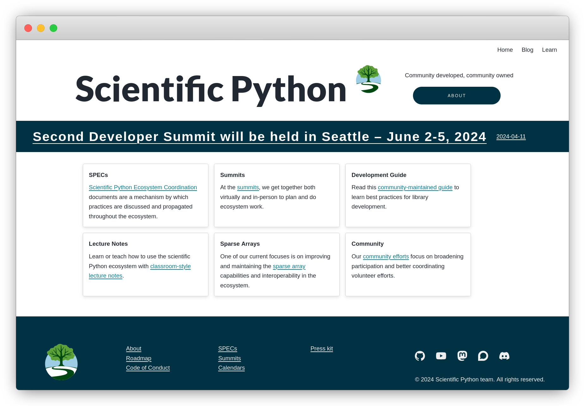
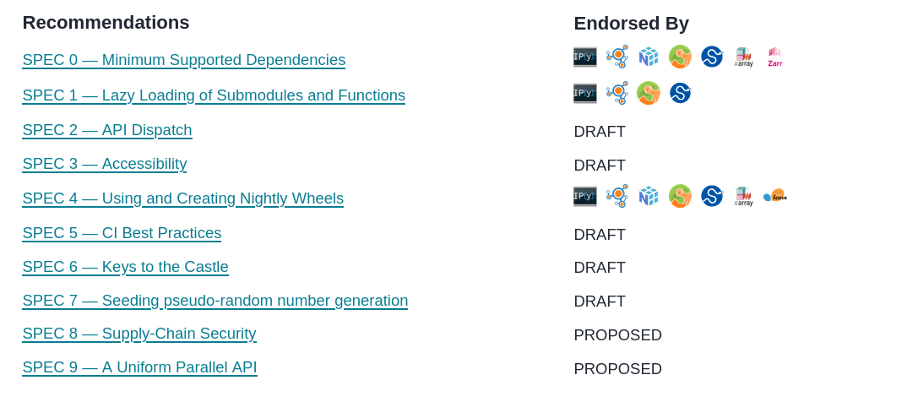
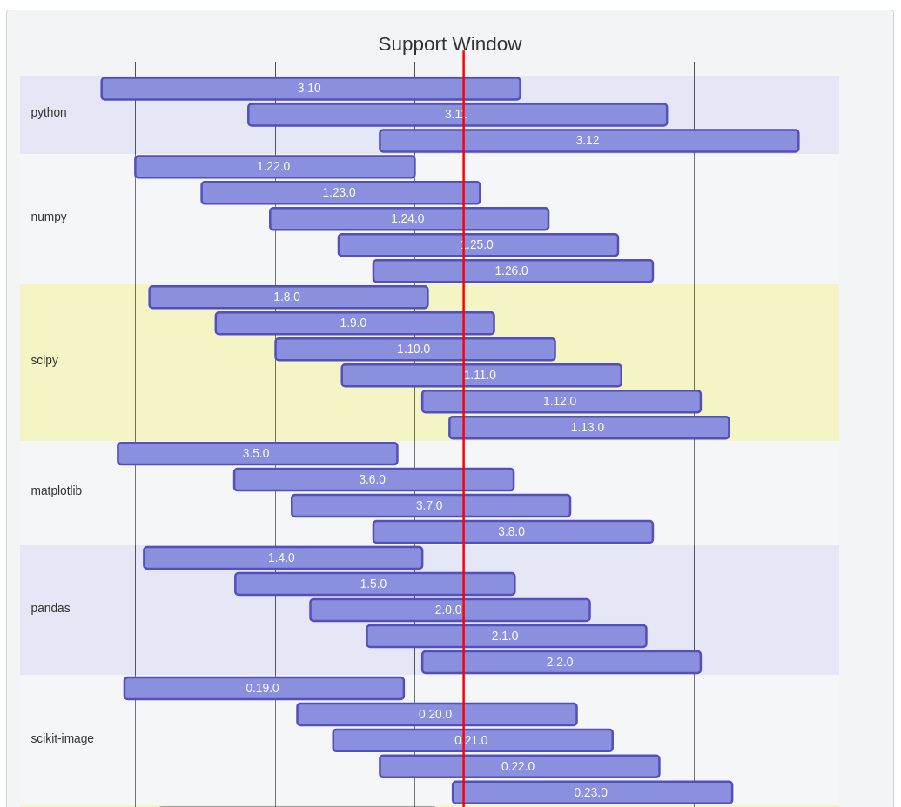
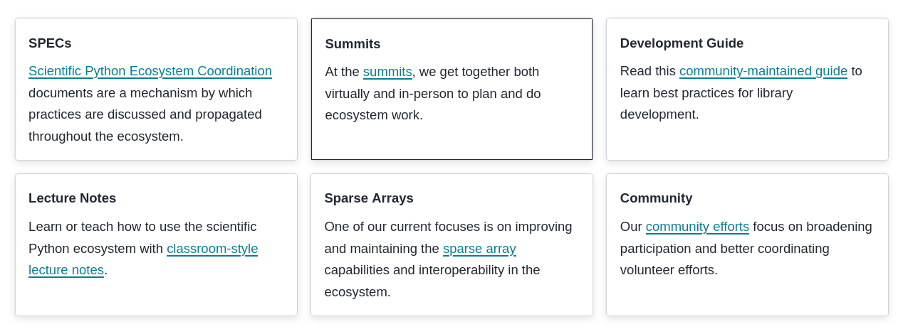
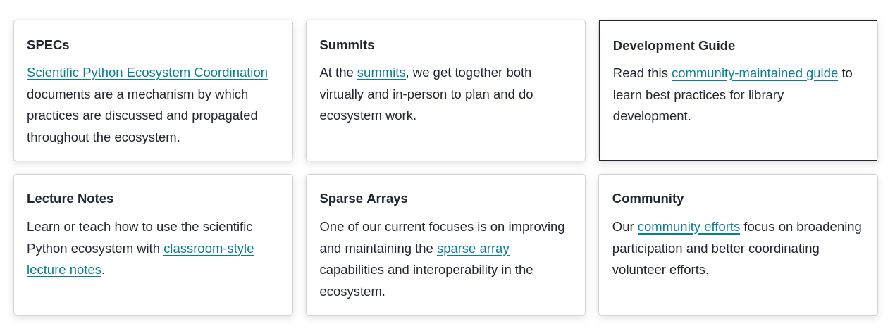
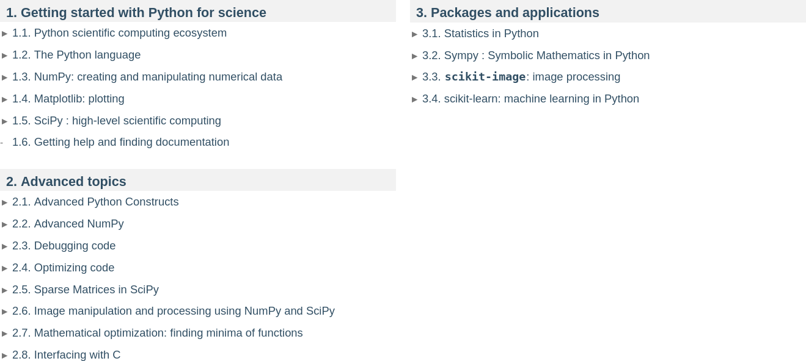
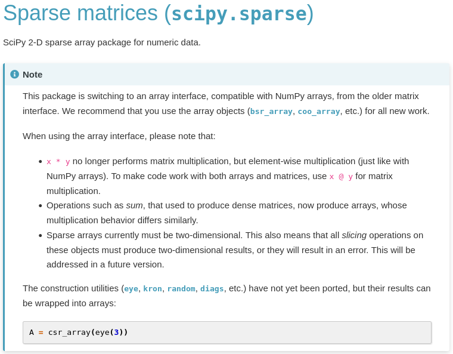
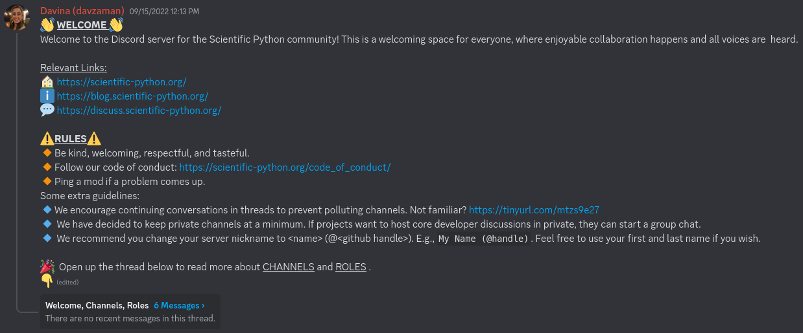
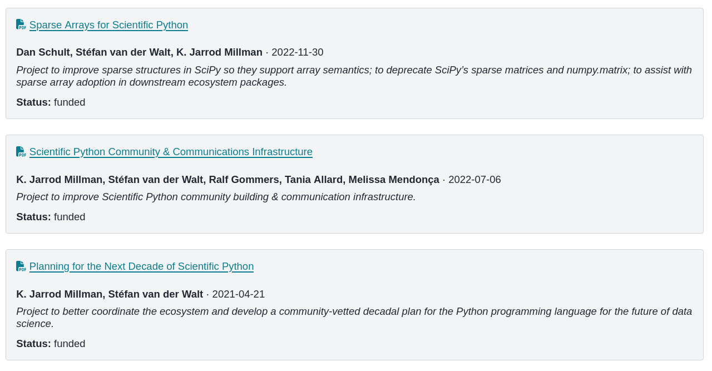
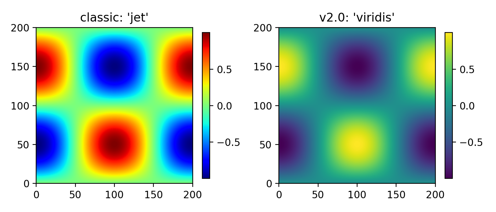

Scientific Python:  Community, Tools, and Open Science

 
 
 
 

Stéfan van der Walt 
BIDS Seminar, 7 May 2024

Notes:

- I promised to tell you about the Scientific Python project.
  And, I'm excited to do so.
- But I thought it might be interesting to give you more of a
  behind-the-scenes, personal overview of how this came to be.
- I want to tell you about the major role Berkeley & BIDS has
  played, and its long history in this space.
- My memory is obviously incomplete and subjective, but the general
  gist is there.

---

## A view from Berkeley

### The characters (2000–2004)

Notes:

- Fernando Pérez is a grad student in physics at CU Boulder.  He's
  working on wavelet analysis in Mathematica, and is interested in a
  new langauge called Python, which lacks symbolic and numerical
  computation facilities.

- Jarrod Millman works at the Brain Imaging Center, supporting their analysis pipeline.
  Crazy mixture of MATLAB, IDL, AWK, Bash, and C.

- Stéfan is grad student in Applied Mathematics in South Africa.
  Frustrated by a lack of workable MATLAB installation and license server issues,
  he is using and working on GNU Octave.

...

### A Spark At Berkeley

Notes:

- Jarrod became motivated to replace the complicate image analysis pipeline with Python.
  Keith Worseley was a big figure in neuroscience; through him, Jarrod was introduced to Jonathan Taylor, a young upcoming statistician, now a Professor at Stanford.
   Googling "Python, imaging, neuroscience", Jarrod came across John Hunter, doing Electrocorticography (ECoG) at the Children's Hospital in Chicago.
  They had a MATLAB pipeline, and he wanted to replace it in Python.
  For that purpose, John started a project called Matplotlib.
  John introduced Jarrod to Fernando.

- At that point, two array libraries, Numeric and Numarray, existed, splitting the community.
  Jarrod and Matthew Brett, who was a visiting research at the time, organized a few meetings
  that brought Travis Oliphant, Numeric maintainer, and Perry Greenfield, numarray maintainer, to campus.
  During this meetings, Travis and Perry figured out how to unify their projects, resulting in what we now know as NumPy.

...

### Teaching "Scientific Python"

Notes:

- Around 2005, first course on campus, and probably *the* earliest course on
  campus, was in Tollman Hall by Fernando and John.
  Dav Clark, who later was a BIDS fellow, came up from Stanford for the workshop.

- Ben Herbst, Stéfan's PhD advisor, visits Colorado on sabbatical.  He
  comes back and, inspired by Fernando, is enthused about a new
  language called Python. He wants me and Fernando to meet.

- Soon after, in 2006, Fernando travels to South Africa and teaches a
  "Py4Science" workshop in Stellenbosch, with Stéfan stepping in to help.

...

### NumPy documentation project

Notes:

- In 2007, Joe Harrington wanted to hire someone to document NumPy and SciPy, which he wanted to use in his courses.
- Fernando and Jarrod phoned me up, and with support from my advisor, I ran the "Documentation Marathon".
  With the community, we built a Wikipedia-like system, and over two years took NumPy and SciPy from virtually no documentation to being fully documented.

...

### Scientific Python @ Berkeley

Notes:

- In 2008, Fernando is appointed at the Brain Imaging Center, where he works closely with Jarrod.
- Around 2010, Jarrod co-organizes SciPy India. Stéfan meets him there, and
  they start working on the proceedings for the US SciPy conference.
- Josh Bloom, Professor in Astronomy, teaches an annual Python
  bootcamp and the AY250 course, through which he helps to establish Python in astronomy.
- Fast forward to 2015, I join the newly formed Berkeley Institute for Data Science.
- Around the same time, the Data Science curriculum is launched, built around Python.

...

### The NumPy Grant

Notes:

- Around 2017, at BIDS we start executing the first ever grants for NumPy, by the Moore & Sloan Foundations
- We bring key ecosystem developers to campus
- One of the challenges we discuss is that:
  - The projects got big, and developers could no longer sit around a table
  - The ecosystem grew organically, and many projects were siloed
  - There was little unity, or careful cross-project design
  - Tools were sometimes borrowed between projects, but then took on a life of their own inside each project
  - Because of their success, there were many more users to support, but no framework within which to do that
  - Industry became much more interested in the ecosystem; what did this mean for the ecosystem developers,
    and how would the community remain involved in steering their projects?
- We therefore started thinking about ways to bring the community together again
  - Discuss strategy
  - Improve uniformity
  - Share technical infrastructure and tools
  - Ensure that projects are community governed and owned

...

### The Scientific Python Project

- July 2018 -- New landing site for Scientific Python ([issue #1](https://github.com/scientific-python/scientific-python.org/issues/1))
- December 2018 -- Chris Mentzel (then Moore Foundation) asks for a short proposal
- January 2019 -- first draft
- June 2020 -- funding approved
- December 2020 -- Jarrod and I officially start The Scientific Python Project

Notes:

- Now, let me tell you about that project, and the work we've done since 2020.

---

### Scientific Python is...

 

a **project** to better coordinate the **ecosystem** and support the community of contributors and **maintainers**.

    

...

#### https://scientific-python.org/

---

 Scientific Python

 
 

Notes:

- Add some notes on the SPECs and what they are

...

#### https://scientific-python.org/specs/

 

Scientific Python Ecosystem Coordination documents provide operational guidelines. 

 

...

## SPEC Core Projects

...

## SPEC Steering Committee

...

## SPEC 0 — Minimum Supported Versions

...

## SPEC 1 — Lazy Loading of Submodules and Functions

...

## SPEC 4 — Using and Creating Nightly Wheels

---

<!-- Section: SP project -->

 Scientific Python

 
 

...

## Second Scientific Python Developer Summit

Planning meeting, yesterday: 

- Seattle, June 3–5: https://scientific-python.org/summits/developer/2024/
- Report from last year: https://blog.scientific-python.org/scientific-python/dev-summit-1/

Notes:

- In-person work meetings

---

<!-- Section: SP project -->

 Scientific Python

 
 

...

#### https://learn.scientific-python.org/development/

...

#### https://learn.scientific-python.org/development/guides/repo-review/

---

<!-- Section: SP project -->

 Scientific Python

 
 

...

#### https://lectures.scientific-python.org/

...

#### https://lectures.scientific-python.org/

---

<!-- Section: SP project -->

 Scientific Python

 
 

...

## Sparse Arrays for Scientific Python

 

- improve sparse structures in SciPy so they support array semantics
- deprecate SciPy’s sparse matrices and `numpy.matrix`
- assist with sparse array adoption in downstream ecosystem packages

 
 
 
 

### More information

- https://scientific-python.org/grants/sparse_arrays/
- https://scientific-python.org/summits/sparse/
- https://scientific-python.org/calendars/
- https://blog.scientific-python.org/scientific-python/dev-summit-1-sparse/

...

#### https://scipy.github.io/devdocs/reference/sparse.html

---

<!-- Section: SP project -->

 Scientific Python

 
 

...

#### https://discuss.scientific-python.org/

...

#### https://discord.com/invite/vur45CbwMz

 
 

...

#### https://blog.scientific-python.org/

---

## Tools

...

 

### Development

- [lazy_loader](https://github.com/scientific-python/lazy_loader/)
- [spin](https://github.com/scientific-python/spin)
- [pytest-doctestplus](https://github.com/scientific-python/pytest-doctestplus)
- [repo-review](https://github.com/scientific-python/repo-review)
- [changelist](https://github.com/scientific-python/changelist/)

 
 

### Web

- [scientific-python-hugo-theme](https://github.com/scientific-python/scientific-python-hugo-theme)

### Organization

- [yaml2ics](https://github.com/scientific-python/yaml2ics)
- [discuss.scientific-python.org](https://discuss.scientific-python.org/)
- [vault-template](https://github.com/scientific-python/vault-template)

 
 

## Insight

- [devstats](https://github.com/scientific-python/devstats)
- [https://views.scientific-python.org/](https://github.com/scientific-python/devstats)

### GitHub

- [upload-nightly-action](https://github.com/scientific-python/upload-nightly-action)
- [attach-next-milestone-action](https://github.com/scientific-python/attach-next-milestone-action)
- [sync-teams-action](https://github.com/scientific-python/sync-teams-action)
- [reverse-dependency-testing](https://github.com/scientific-python/reverse-dependency-testing)
- [action-check-changelogfile](https://github.com/scientific-python/action-check-changelogfile)
- [action-towncrier-changelog](https://github.com/scientific-python/action-towncrier-changelog)

...

#### https://scientific-python.org/calendars/

...

#### https://devstats.scientific-python.org/

---

## On the horizon

Fernando Pérez, academic director, vision:

https://bids.berkeley.edu/about/directors-vision-2024

A renewed emphasis of the importance of open software and research:

> Our scientists partner with an extended, distributed **community** of
> other researchers and developers to **build** an **ecosystem** that benefits
> **all**. This is how we will build much more in coming years: work
> grounded in the **expertise** of our scholars and immediately **applied** to
> our research and educational needs, but in **open collaboration** with
> partners near and far, to build **access** to **research** and **education**
> that is **impactful**, **accessible**, and **fair**.

...

## On the horizon

[Open Source Project Office](https://bids.berkeley.edu/news/uc-berkeley-joins-effort-advance-open-source-initiatives-across-uc-system)

Areas we intend to work on:

- statistics in Python
- domain stacks (astronomy, earth & space science)
- supply-chain security 
  [Panel on May 9th](https://events.berkeley.edu/BIDS/event/246188-understanding-the-xz-security-breach-and-open-source-).
- coordinated releases
- summer schools
- vetted, shared governance models

... and more.

Notes:

- OSPO: an attachment-point for open source conversations on campus

---

### Q&A

https://scientific-python.org

 

Follow me on Mastodon: 
 
<a href="https://emacs.ch/@stefanv">@stefanv@mentat.za.net</a>

---

# Extra slides

...

## Challenges in OS Scientific Software

- Grow the contributor pool
- Sustain the contributor pool
- Governance

...

## Support

- Contribute or support students who want to
- Reward and recognize efforts outside of paper writing
- Fund open, not closed software (and convince funders to do the
  same!)
- Apply lessons from SP to your work
  1. Test research code
  2. Executable papers (AKA automate everything)
  3. Collaborate widely, credit all those involved
  4. Insist on open code & data (reviewing and publishing)

*Developing open source scientific practice* 
K. Jarrod Millman & Fernando Pérez 
https://www.jarrodmillman.com/oss-chapter.html

...

### Benefits for Contributors

- Advance science
- Make an impact
- Grow as a developer
- Shape the tools you use

You are very welcome to join!

...

#### https://scientific-python.org/grants/

...

### (Sideline) What about AI?

Are "traditional" scientific computational tools (algorithmic implementations) still viable.

Notes:

- Won't go too deeply into this now, but it's an interesting question to consider:

  - Given the resurgence in AI research, and the many incredible applications we've seen, is there still room for libraries that implement "classic" algorithms?

- My quick answer to that is: yes.

  - Libraries are as much about establishing APIs, i.e., human interfaces, as they are about code, and the skill of producing those and shipping them remains relevant.

  - Sometimes, you know what you need to do with your numbers. E.g., you may simply want to compute an FFT. Then, you want NumPy or SciPy around to do that for you. Often, you need to pre-process your data, or post-process AI output. AI and classical tools work well enough together.

  - Not all problems are well suited to AI and we are still in the very beginning of understanding the reliability of AI predictions, and knowing its failure modes. This is an evolving space that we're watching with interest.

...

### Some notable BIDS projects

 

...

### Modifying your tools (a short detour)

Notes:

- Got 3D printer as a gift
- A paradigm shift; no longer go to Ace and jury rig a part
- If you want to make a custom part or tool, you need to understand the problem very well
- But once you do, you can make the tool that *exactly* matches what you need
- For home improvement that doesn't matter so much; for science it is very important.

---
