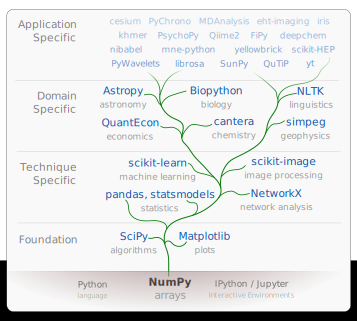
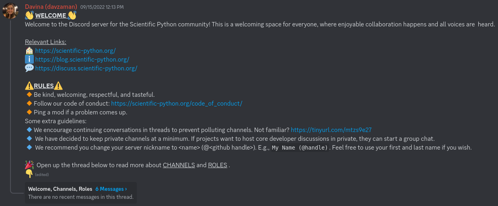

Scientific Python:  In support of the developer community

 
 
 
 

Stéfan van der Walt 
EuroSciPy 2024, 28 August 2024

Notes:

Introduce yourself, history with the scientific Python ecosystem, etc.

---

### What, and why?

 

a **project** to better coordinate the **ecosystem** and support the community of contributors and **maintainers**.

    

Notes:

Explain how conversations used to happen around the table at SciPy and EuroSciPy.
How developers all used to know one another.

...

### Timeline

- July 2018 — New landing site for Scientific Python ([issue #1](https://github.com/scientific-python/scientific-python.org/issues/1))
- December 2018 — Asked by the Moore Foundation for a short proposal
- January 2019 — first draft
- June 2020 — funding approved
- December 2020 — Jarrod Millman and I officially start The Scientific Python Project

Notes:

- A lot of work's been done since then! We'll outline some of it here.

...

#### https://scientific-python.org/

---

 Scientific Python

 
 

Notes:

- Add some notes on the SPECs and what they are

...

#### https://scientific-python.org/specs/

 

Scientific Python Ecosystem Coordination documents provide operational guidelines. 

 

...

## SPEC Core Projects

...

## SPEC Steering Committee

...

## SPEC 0 — Minimum Supported Versions

...

## SPEC 1 — Lazy Loading of Submodules and Functions

...

## SPEC 4 — Using and Creating Nightly Wheels

...

## SPEC 6 — Keys to the Castle

...

## SPEC 7 — Seeding pseudo-random number generation

...

## SPEC 8 — Securing the Release Process

---

<!-- Section: SP project -->

 Scientific Python

 
 

...

## Second Scientific Python Developer Summit

- Seattle, June 3–5: https://scientific-python.org/summits/developer/2024/
- Report from last year: https://blog.scientific-python.org/scientific-python/dev-summit-1/

Notes:

- In-person work meetings

---

<!-- Section: SP project -->

 Scientific Python

 
 

...

#### https://learn.scientific-python.org/development/

...

#### https://learn.scientific-python.org/development/guides/repo-review/

---

<!-- Section: SP project -->

 Scientific Python

 
 

...

#### https://lectures.scientific-python.org/

...

#### https://lectures.scientific-python.org/

---

<!-- Section: SP project -->

 Scientific Python

 
 

...

## Sparse Arrays for Scientific Python

 

- improve sparse structures in SciPy so they support array semantics
- deprecate SciPy’s sparse matrices and, eventually, `numpy.matrix`
- assist with sparse array adoption in downstream ecosystem packages

 
 
 
 

### More information

- https://scientific-python.org/grants/sparse_arrays/
- https://scientific-python.org/summits/sparse/
- https://scientific-python.org/calendars/
- https://blog.scientific-python.org/scientific-python/dev-summit-1-sparse/

...

#### https://scipy.github.io/devdocs/reference/sparse.html

---

## CZI grant

- In collaboration with Quansight
- Accessibility
  - https://pydata-sphinx-theme.readthedocs.io/en/stable/
- Translation
  - https://blog.scientific-python.org/scientific-python/translations/
  - https://scientific-python-translations.github.io/
- Scientific Python Hugo theme
- DevStats
- interactive docs
  (building on work by Pyodide & JupyterLite teams)
- Release management / tooling

---

<!-- Section: SP project -->

 Scientific Python

 
 

...

#### https://discuss.scientific-python.org/

...

#### https://bit.ly/talk-sp

 

...

#### https://blog.scientific-python.org/

---

## Tools

...

 

### Development

- [lazy_loader](https://github.com/scientific-python/lazy_loader/)
- [spin](https://github.com/scientific-python/spin)
- [pytest-doctestplus](https://github.com/scientific-python/pytest-doctestplus)
- [repo-review](https://github.com/scientific-python/repo-review)
- [changelist](https://github.com/scientific-python/changelist/)

 
 

### Web

- [scientific-python-hugo-theme](https://github.com/scientific-python/scientific-python-hugo-theme)

### Organization

- [yaml2ics](https://github.com/scientific-python/yaml2ics)
- [discuss.scientific-python.org](https://discuss.scientific-python.org/)
- [vault-template](https://github.com/scientific-python/vault-template)

 
 

## Insight

- [devstats](https://github.com/scientific-python/devstats)
- [https://views.scientific-python.org/](https://github.com/scientific-python/devstats)

### GitHub

- [upload-nightly-action](https://github.com/scientific-python/upload-nightly-action)
- [attach-next-milestone-action](https://github.com/scientific-python/attach-next-milestone-action)
- [sync-teams-action](https://github.com/scientific-python/sync-teams-action)
- [reverse-dependency-testing](https://github.com/scientific-python/reverse-dependency-testing)
- [action-check-changelogfile](https://github.com/scientific-python/action-check-changelogfile)
- [action-towncrier-changelog](https://github.com/scientific-python/action-towncrier-changelog)

...

#### https://scientific-python.org/calendars/

...

#### https://devstats.scientific-python.org/

---

### How can you get involved?

...

### Q&A

https://scientific-python.org

 

Follow me on Mastodon: 
 
<a href="https://emacs.ch/@stefanv">@stefanv@mentat.za.net</a>
