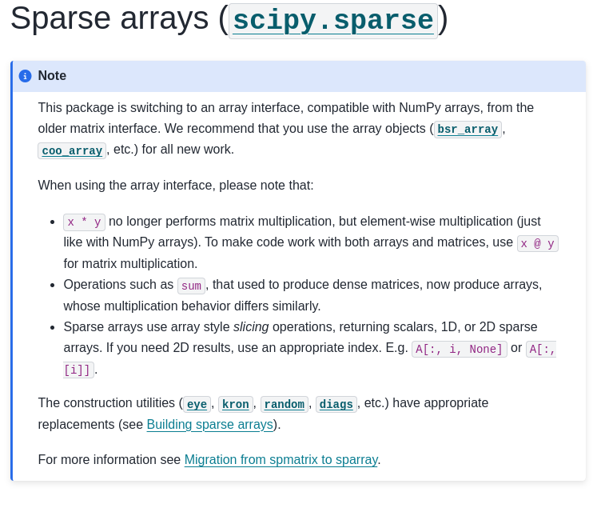

The Scientific Python Project and the Berkeley Open Source Program Office

 
 
 
 

Jarrod Millman 
Berkeley Lab – CS Seminar, 5 February 2025

Notes:

- talk about the Scientific Python project.
- first behind-the-scenes, personal overview of how this came to be.
- the major role Berkeley & BIDS has played, and its long history in this space.
- personal perspective / story telling
- reason: BIDS / OSPO looking for collaborators / colleagues

---

## A Spark At Berkeley

### 2003–2012

Notes:

- in charge of the BIC fmri data analysis pipeline
- ad hoc collection of scripts and bespoke programs in a variety of languages
- little engineering focus
- motivated to replace the complicate image analysis pipeline with Python
- Python wasn't really a serious alternative to Matlab / IDL
- 2004 meeting Jonathan, John (ECoG), Fernando, Travis, Perry, et al
- 2005, first course on campus, and probably *one of the* earliest
  courses anywhere, was given in Tolman Hall by Fernando and John.
- 2008, Fernando is appointed at the BIC
- 2010 I co-organizes SciPy India. meets Stéfan, US SciPy conference proceedings
- Josh Bloom, annual Python bootcamp and the AY250 course

...

## Berkeley Institute for Data Science

### 2013–2023

Notes:
- I went back to graduate school
- Saul Perlmutter established BIDS in 2013
- initially funded by grants from the Gordon and Betty Moore Foundation and the Sloan Foundation
- 2015, Stefan hired
- Around the same time, the Data Science curriculum is launched, built around Python.
- 2017, Jarrod BIDS graduate fellow

...

## The NumPy Grant

### 2017–2020

Notes:

- 2017, at BIDS we start executing the first ever grants for NumPy, by the Moore & Sloan Foundations
- We bring key ecosystem developers to campus
- One of the challenges we discuss is that:
  - projects got big, and developers could no longer sit around a table
  - ecosystem grew organically, and many projects were siloed
  - little unity, or careful cross-project design
  - Tools were sometimes borrowed between projects, but then took on a life of their own inside each project
  - Because of their success, there were many more users to support, but no framework within which to do that
  - Industry became much more interested in the ecosystem; what did this mean for the ecosystem developers,
    and how would the community remain involved in steering their projects?
- We therefore started thinking about ways to bring the community together again
  - Discuss strategy
  - Improve uniformity
  - Share technical infrastructure and tools
  - Ensure that projects are community governed and owned

...

## The Next Decade of Scientific Python

### 2018–

Notes:

- July 2018 -- New landing site for Scientific Python ([issue #1](https://github.com/scientific-python/scientific-python.org/issues/1))
- December 2018 -- Chris Mentzel (then Moore Foundation) asks for a short proposal
- January 2019 -- first draft
- June 2020 -- funding approved
- December 2020 -- Stefan and I officially start The Scientific Python Project
- Now, let me tell you about that project, and the work we've done since 2020.

### Scientific Python is...

 

a **project** to better coordinate the **ecosystem** and support the community of contributors and **maintainers**.

    

...

#### https://scientific-python.org/

---

 Scientific Python

 
 

Notes:

- Add some notes on the SPECs and what they are

...

#### https://scientific-python.org/specs/

...

## SPEC 0 — Minimum Supported Versions

...

## SPEC 4 — Using and Creating Nightly Wheels

---

<!-- Section: SP project -->

 Scientific Python

 
 

---

<!-- Section: SP project -->

 Scientific Python

 
 

...

#### https://learn.scientific-python.org/development/

Notes:

- tutorial aims to help scientists who write code find good practices and standard tools,
  and to help small- and medium-sized scientific software projects start off on the right foot.
- topical guides intended for developers who are making or maintaining a package and want
  to follow modern best practices in Python.
- principles focused on designing good software, with a focus on end-user research code.
- patterns is a collection of common patterns in scientific software that are worth learning.

...

#### https://learn.scientific-python.org/development/guides/repo-review/

---

<!-- Section: SP project -->

 Scientific Python

 
 

...

#### https://lectures.scientific-python.org/

---

<!-- Section: SP project -->

 Scientific Python

 
 

...

## Sparse Arrays for Scientific Python

- improve sparse structures in SciPy so they support array semantics
- assist with sparse array adoption in downstream ecosystem packages
- deprecate SciPy’s sparse matrices and numpy.matrix

<!--
Notes:

- at added in Py 3.5
- PEP 465 A dedicated infix operator for matrix multiplication Nathaniel J. Smith
- stackoverflow.com/questions/53254738/deprecation-status-of-the-numpy-matrix-class
- May 2018 (numpy 1.15) the matrix class docstring contains the following note:
- It is no longer recommended to use this class, even for linear algebra.
- Instead use regular arrays. The class may be removed in the future.
-->
...

#### https://docs.scipy.org/doc/scipy-1.15.1/reference/sparse.html

...

## Ecosystem support for sparse arrays

- NetworkX
- scikit-image
- dipy
- mne-python
- pyamg
- cvxpy
- scikit-learn
- scanpy
- anndata
- ...

Notes:
- drop 1.14 - 2026 - Quarter 2
- numpy.matrix future ?
- at added in Py 3.5

---

<!-- Section: SP project -->

 Scientific Python

 
 

...

#### https://discuss.scientific-python.org/

Notes:
- 450+ members

...

#### https://discord.com/invite/vur45CbwMz

 
 

Notes:
- 590+ members
...

#### https://blog.scientific-python.org/

---

## https://tools.scientific-python.org/

...

#### https://scientific-python.org/calendars/

---

## Back to Berkeley

...

## The Next Decade of BIDS

### 2024–2034

https://bids.berkeley.edu/about/directors-vision-2024

Notes:

A renewed emphasis of the importance of open software and research:

> Our scientists partner with an extended, distributed **community** of
> other researchers and developers to **build** an **ecosystem** that benefits
> **all**. This is how we will build much more in coming years: work
> grounded in the **expertise** of our scholars and immediately **applied** to
> our research and educational needs, but in **open collaboration** with
> partners near and far, to build **access** to **research** and **education**
> that is **impactful**, **accessible**, and **fair**.

- In 2024, Fernando become BIDS faculty director
- In 2025, Kirstie joins BIDS as ED

...

### https://ospo.berkeley.edu/

Notes:
- funded late Spring 2024
- kick-off event May
- OSPO: an attachment-point for open source conversations on campus
- Areas we intend to work on:
- statistics in Python
- supply-chain security
- domain stacks (neuroscience, earth & space science, ...)
- coordinated releases
- summer schools
- vetted, shared governance models

... and more.

...

### https://strudel.science/

---

### Q&A

- https://scientific-python.org
- https://bids.berkeley.edu
- https://ospo.berkeley.edu (coming)
  - (https://ospo-berkeley-edu.netlify.app/)

---

# Extra slides

...

## Open Source Program Office  OSPO

Notes:

- An open source program office (OSPO) serves as the center of competency for an organization's open source operations and structure.
  https://github.com/todogroup/ospodefinition.org

- An Open Source Program Office (OSPO) is a department formed by subject-matter experts involved in free and open software. 
  https://en.wikipedia.org/wiki/Open_Source_Program_Office

...

## Open Source Program Office

### In Industry

<blockquote>
"The Google Open Source Programs Office dates back to 2004, making it one of the first OSPOs in the industry."

—https://opensource.google/about
</blockquote>

Notes:
- to build on open source technologies and share Google-developed technology under open licenses
- Google Summer of Code in 2005
- Season of Docs in 2019
- 2023 several members of Google’s Open Source Programs Office were let go

...

### In Academia

<blockquote>
"Since 2020, the Alfred P. Sloan Foundation has been helping universities
establish Open Source Program Offices (OSPOs) as a strategy to institutionalize
support for open source software in research and beyond."

—https://sloan.org/programs/digital-technology/ospo-loi
</blockquote>

Notes:

- Johns Hopkins University 2021
- CURIOSS 2023
- 22 members 

...

### https://ucospo.net/

Notes:
- funded late Spring 2024
- kick-off event May

...

### https://ospo.berkeley.edu/

Notes:
- funded late Spring 2024
- kick-off event May

---

## SPEC Core Projects

...

## SPEC Steering Committee

...

## SPEC 1 — Lazy Loading of Submodules and Functions

...

## Second Scientific Python Developer Summit

Planning meeting, yesterday: 

- Seattle, June 3–5: https://scientific-python.org/summits/developer/2024/
- Report from last year: https://blog.scientific-python.org/scientific-python/dev-summit-1/

Notes:

- In-person work meetings

...

 

### Development

- [lazy_loader](https://github.com/scientific-python/lazy_loader/)
- [spin](https://github.com/scientific-python/spin)
- [pytest-doctestplus](https://github.com/scientific-python/pytest-doctestplus)
- [repo-review](https://github.com/scientific-python/repo-review)
- [changelist](https://github.com/scientific-python/changelist/)

 
 

### Web

- [scientific-python-hugo-theme](https://github.com/scientific-python/scientific-python-hugo-theme)

### Organization

- [yaml2ics](https://github.com/scientific-python/yaml2ics)
- [discuss.scientific-python.org](https://discuss.scientific-python.org/)
- [vault-template](https://github.com/scientific-python/vault-template)

 
 

## Insight

- [devstats](https://github.com/scientific-python/devstats)
- [https://views.scientific-python.org/](https://github.com/scientific-python/devstats)

### GitHub

- [upload-nightly-action](https://github.com/scientific-python/upload-nightly-action)
- [attach-next-milestone-action](https://github.com/scientific-python/attach-next-milestone-action)
- [sync-teams-action](https://github.com/scientific-python/sync-teams-action)
- [reverse-dependency-testing](https://github.com/scientific-python/reverse-dependency-testing)
- [action-check-changelogfile](https://github.com/scientific-python/action-check-changelogfile)
- [action-towncrier-changelog](https://github.com/scientific-python/action-towncrier-changelog)
- [circleci-artifacts-redirector-action](https://github.com/scientific-python/circleci-artifacts-redirector-action)
- [devstats-query-action](https://github.com/scientific-python/devstats-query-action)
- [MeeseeksDev / Lumberbot (App)](https://github.com/scientific-python/MeeseeksDev)

...

#### https://devstats.scientific-python.org/

...

## On the horizon

[Open Source Project Office](https://bids.berkeley.edu/news/uc-berkeley-joins-effort-advance-open-source-initiatives-across-uc-system)

Areas we intend to work on:

- statistics in Python
- supply-chain security
- domain stacks (neuroscience, earth & space science, ...)
- coordinated releases
- summer schools
- vetted, shared governance models

... and more.

Notes:

- OSPO: an attachment-point for open source conversations on campus
- Areas we intend to work on:
- statistics in Python
- supply-chain security
- domain stacks (neuroscience, earth & space science, ...)
- coordinated releases
- summer schools
- vetted, shared governance models

and more.

...

#### https://lectures.scientific-python.org/

