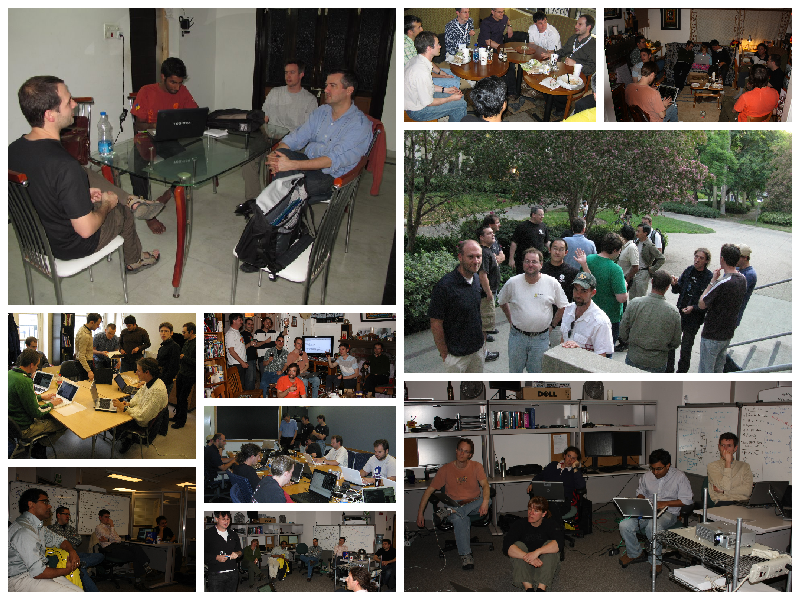

 Scientific Python

Past, future, and present

 
 
 
 

K. Jarrod Millman 
University of California, Berkeley

...

## https://scientific-python.org

> The **Scientific Python project** aims to better coordinate the
> ecosystem and grow the community.

Notes:

Hi everyone,

Today, I am excited to introduce to you a new planning effort for
better coordinating the Scientific Python ecosystem.

So, perhaps unlike the other talks in this session, this talk is not about one
specific tool, but rather about *all* the tools and how they work together.

---

 Scientific Python

 
 
 
 

Why is it needed?

...

## Hard for maintainers to coordinate

Notes:

In the early days, the developer communtity was small and the user base not much
bigger.
User support wasn't a lot or work.
Maintainers were often on other project mailing lists.
The SciPy conference was small and most attendees were core library developers.

Now, the ecosystem and user community has grown.
The SciPy confernence has 100s of attendees and isn't focused on the maintainers.
Maintainers rarely have enough time to keep up with their own mailing lists
and developer discussions.
There is no forum for cross-project developer planning and discussions.

...

## Hard for new people to become maintainers

Notes:

Granted the tooling (think:  svn vs. git) is better now; but,
in the beginning, contributing was easier in many ways.

There was much less code depending on the core libraries.
So it was easier to break things.
There was a lot of missing pieces.
So it was easy to find something that needed to be done.
There was much less highly-optimized code.
So it was easier to understand the existing code.

...

> The **Scientific Python project** aims to better coordinate the
> ecosystem and grow the community.

 
 
 

1. Support & develop shared infrastructure
2. Foster the next generation of contributors
3. Create coordinating forum and mechanisms
4. Develop community-vetted strategic plan

Notes:

And, to address that, we are launching an effort to get projects talking to
one another again, to strategize about their joint future, and to make that future a reality.

---

 Scientific Python

 
 
 
 

Support & develop shared infrastructure

...

## Shared instrastructure

- https://scientific-python.org/calendars/
- https://theme.scientific-python.org/
- https://discuss.scientific-python.org/
- https://devstats.scientific-python.org/
- https://blog.scientific-python.org/

Notes:

  - Tools used across ecosystem such as numpydoc
  - Community calendars
  - Standard web themes for core projects
  - Common discussion forums
  - Developer statistics dashboard
  - Benchmarking & testing
  - Web analytics

BTW, a little easter egg on the NumPy frontpage to try!

---

 Scientific Python

 
 
 
 

Foster the next generation of contributors

...

- https://twitter.com/scientific_py
- https://tinyurl.com/scientific-python-youtube

Notes:

  - Make it easy for new contributors to join the project
  - Social media
    - Onboarding
    - Dev interviews
    - SP library examples
  - Learn: material for users, contributors, maintainers
  - Blog: informal
  - Discourse discussion forum

...

## People

\+ &nbsp; `  {accessiblity, spec, theme, blog, ...} teams`

---

 Scientific Python

 
 
 
 

Create coordinating forum and mechanisms

...

https://scientific-python.org/specs

Notes:

- Coordinate projects
  - SPECs (like PEPs, high level, endorsed by "core")
    - SPECs also allow for younger projects to propose ideas
  - Venues for discussion
    - Discourse forum
    - Virtual technical meetings
  - Watch ecosystem, identify pain points, and coordinate response
    - Like developer meetings (currently virtual)
  - Eventually again have an annual developer meeting

...

## SPEC Core Projects

...

## SPEC Steering Committee

---

 Scientific Python

 
 
 
 

Develop community-vetted strategic plan

...

## Ecosystem-wide vision

 

### 2000&ndash;2010

Driven by individual efforts and needs.

### 2010&ndash;2020

Individual projects adopt governance structures,
development processes, and roadmaps.

### 2020&ndash;2030

Need to think more strategically about the
ecosytem as a whole.

...

## Get projects funded

 

Large-scale plans require long-term, sustained effort.

Funding is needed for increased participation.

Community is just starting to get funding.

Notes:

- Get projects funded

  - Decadal dev plan (evidence of need)
  - Workshops on grant writing
  - Funding is crucial for increased participation (via,
    e.g. full-time paid roles)

---

### Learn more

#### https://scientific-python.org

Has links to:

- Blog: https://blog.scientific-python.org
- Twitter: https://twitter.com/scientific_py
- YouTube: https://tinyurl.com/scientific-python-youtube
- Discourse: https://discuss.scientific-python.org
