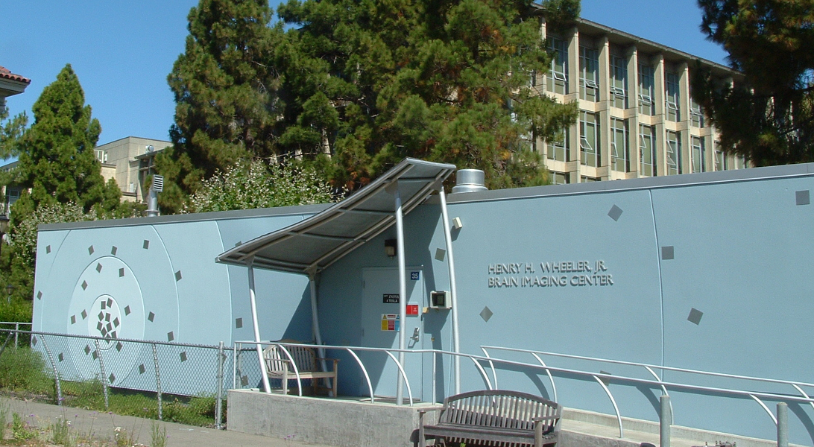
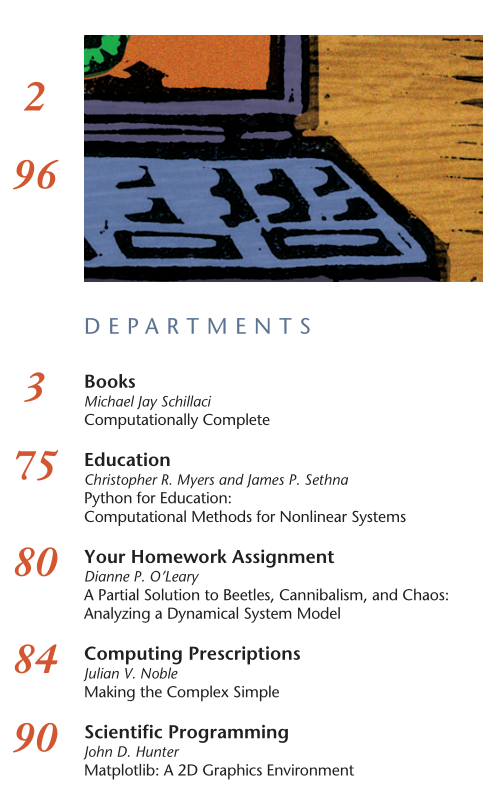
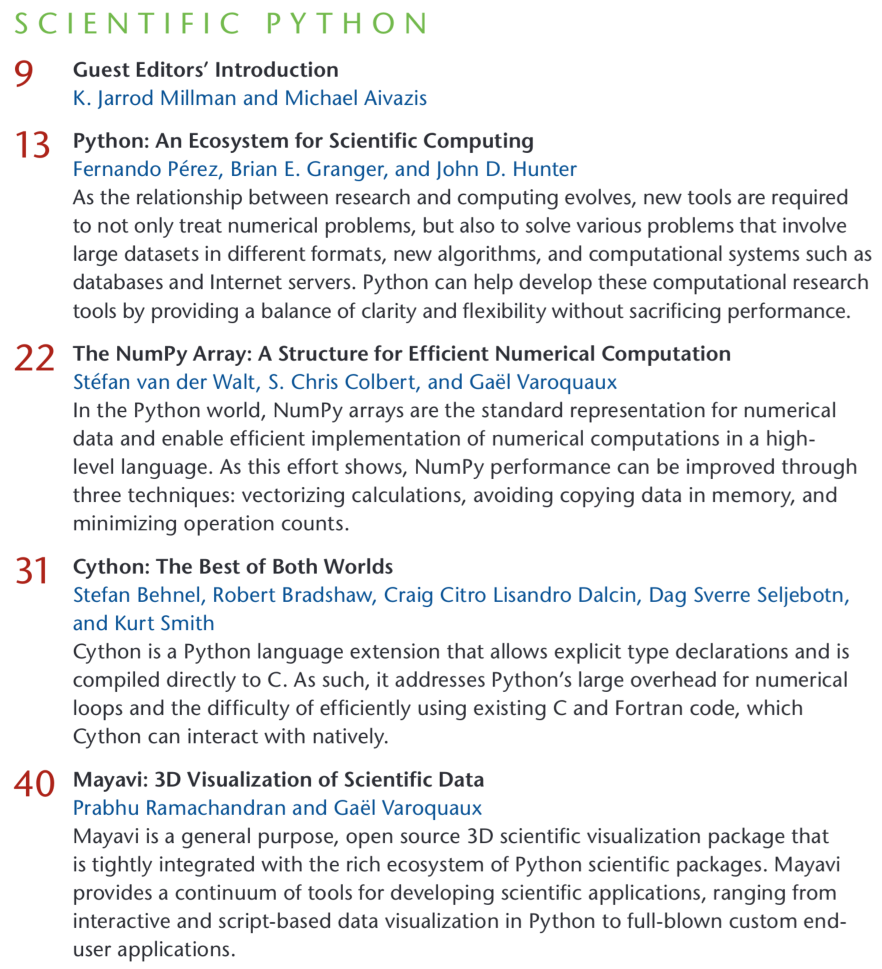
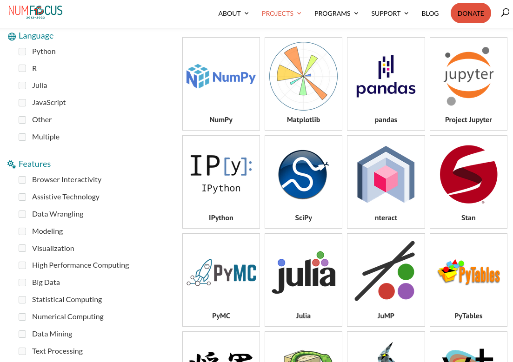
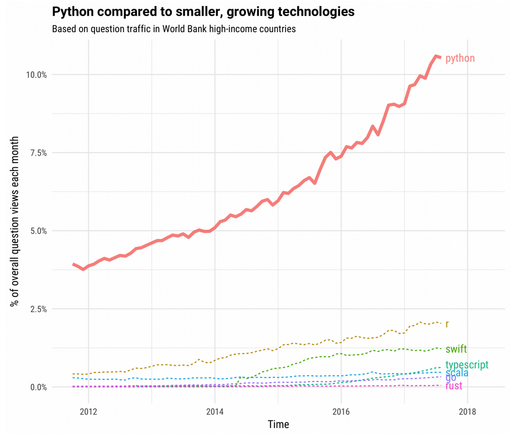
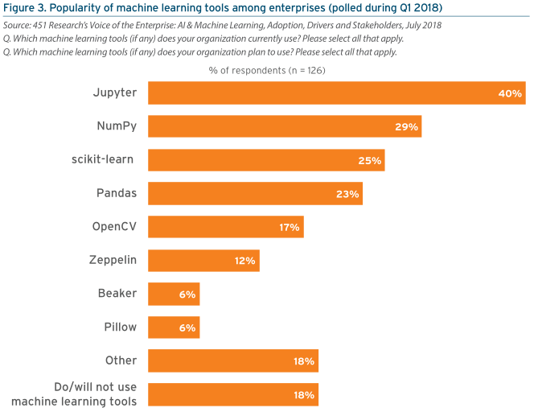
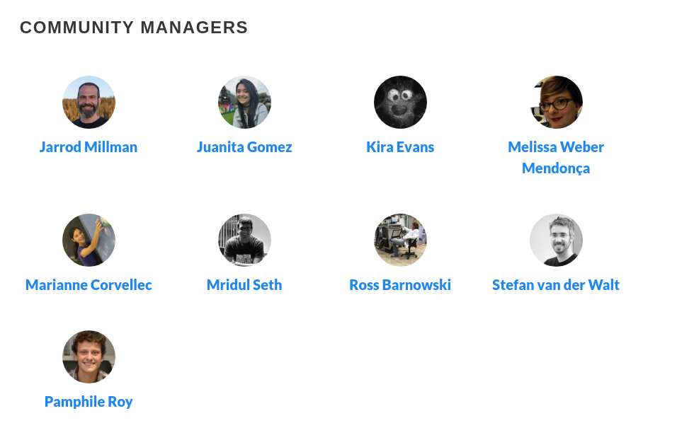
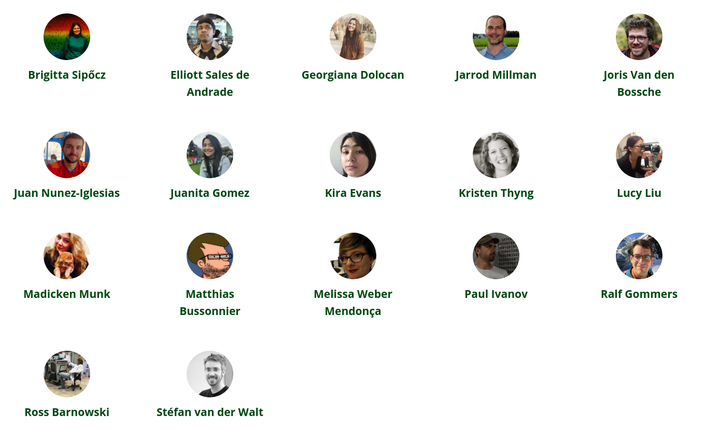

 Scientific Python

 
 
 
 
 
 
 

K. Jarrod Millman 
University of California, Berkeley

...

 Scientific Python is 

 

an **ecosystem** of Python packages for scientific research and data analysis

a **community** of developers, maintainers, and users of tools in the ecosystem

a **new project** that aims to better coordinate the ecosystem and grow the community

---

 Scientific Python

 
 
 
 

A short history

Notes:

- personal account

  - involved at an early stage
  - many community members will tell you a similar story

- largely motivated to solve a series of problems

...

## 2000: Brain Imaging Center

...

## 2004&ndash;2005: Neuroimaging in Python

> We believe that neuroscience ideas and analysis develop
> together.
> Good ideas come from understanding; understanding comes
> from clarity, and clarity must come from well-designed teaching
> materials and well-designed software.
> The software must be designed
> as a natural extension of the underlying ideas.
>
http://nipy.org/nipy/mission.html

...

## 2007: 1<small>st</small> CiSE Special Issue

...

## 2007: 1<small>st</small> CiSE Special Issue

...

## 2008&ndash;2011: Growth of the SciPy Conference

Note:

- < 100 participants
- > 800 participants
- Rock Auditorium has seating capacity of 100
...

## 2011: 2<small>nd</small> CiSE Special Issue

...

## 2012: NumFOCUS

---

 Scientific Python

 
 
 
 

Growth and adoption

Notes:

<!-- Section: success of SP -->

...

<!-- https://stackoverflow.blog/2017/09/06/incredible-growth-python/ -->

...

...

...

*Pathfinder Report: Routes to Enterprise Open Source Data Science Adoption*
 
Data Iku, August 2018

<!-- https://pages.dataiku.com/451-open-source-report -->

...

...

Notes:

Really big corps are now using us to sell their product.

GitHub: Nate's talk with our faces in background

Emphasizing that importing these libraries is essentially broadening
your developer team, "giving them commit access to your project".

...

...

2020 CZI Essential Open Source Software for Science Meeting

Notes:

US govt probably spent a billion dollars on it...

... but it's all based on free software.

...

## Teaching Python

At Berkeley, at least:

- Computer Science
- Data Science
- Information School
- Neuroimaging
- Statistics

... to name a few.

 

*Teaching Computational Reproducibility for Neuroimaging*, 
K. Jarrod Millman, Matthew Brett, Ross Barnowski, and J.-B. Poline 
https://www.frontiersin.org/articles/10.3389/fnins.2018.00727/pdf

Notes:

In the beginning, we could not even find rooms on campus to teach
this.  Still, had several workshops, bootcamps, etc.

Now, it is ubiquitous.

This is no longer unusual, not only at UCB.

(Teaching, in itself, does not mean the tools are good for science,
but there's a practical element to it, namely...)

Students are equipped with Python by the time they arrive in research.

...

Use of Scientific Python is pervasive

It is being used in novel and leading science

It is continually improving, growing, responding to needs

Notes:

Despite this, poorly funded, mainly driven by volunteers outside of
their main jobs.

Very few people are rewarded for working on this (sometimes quite the contrary).

Re: responding to needs, NumPy is stable, yet refactoring entire data type system.

...

The Scientific Python ecosystem of libraries
is **critical research infrastructure**.

Notes:

- Research is becoming more data-dependent.
- Research therefore cannot happen without software.
- Research software relies on *reliable* computational libraries.

In some ways, software is becoming like what math is in research.
Lots of training for math, but very little for scientific software development.

Software is the instrument with which we see data.
It is the way we express our thoughts and reason about the world.

---

<!-- Section: SP project -->

 Scientific Python

 
 
 
 

Lessons and challenges

Notes:

...

## Why adoption and growth so unusual

 

- Who developed the software?
- When, and with what?
- What did it replace?

Notes:

- Small handful of students, junior researchers, other volunteers
- Predominantly in their spare time, over weekends and evenings
- Often little to no financial support
- Against wishes / recommendations of many colleagues (not Ben!)

Competing against platforms built by companies with:

- Millions of dollars in funding
- Hundreds of dedicated programmers
- Pushes by big marketing teams, contracts with many corporations and universities

...

## Why it isn't surprising

 

📜 Principles &nbsp;&nbsp;&nbsp;&nbsp;&nbsp;
🚜 Practices &nbsp;&nbsp;&nbsp;&nbsp;&nbsp;
🤸🏿 People

...

## Principles

 

- Scientific software must be **community developed**, and **community owned**
- This is the best way to align incentives for doing good quality, transparent, reproducible science

Notes:

- We believe that researchers know their needs best
- Their ideas must be surfaced and integrated into the computational
  platform as efficiently as possible
- In this endeavor, making money for shareholders is at best a
  distraction
  - But often, it incentivises entirely the wrong things: hardware
    locks, license servers, closed file formats
  - Incentive to lock users into  proprietary systems
    - This prohibits sharing, reproducibility, and transparency

- Transparency: you *should* always be able to investigate the
  *entire* scientific stack.
- To know answers are accurate, you have to be able to look under the
  hood.
- You also need to be able to modify tools to do *new things*, to do
  *whatever* needs to be done.
- The change required is bigger than just open software; you need
  reproducible research as well (i.e. data/methods publishing). But
  it's a start.

...

## Principles (II)

 

The **importance of language and library choices** cannot be underestimated.

- General-purpose
- Readable code
- Prioritize human (not computer) time

Notes:

- Re-emphasises the notion of a user-developer
- Library interfaces and language clarity / expressivity matter: it's
  how we express our thoughts.

...

## Practices

 

**Technical**

- Revision control
- Testing / continuous integration
- Code review
- Documentation
- Iteration

**Social**

- Governance (*see also:* people)

Notes:

No matter how sound philosophy, we still need working code!

<!-- Code review both during development cycle, but also during use where
users can easily introspect for problems. -->

<!-- Documentation has to stay in sync with code (docstrings). -->

...

...

## People

> Healthy communities are built when everyone's voice is heard, when
> their perspective is valued, and when their work is recognized.

https://scientific-python.org/about

 

Work done in collaboration is better and more fun.

- **Community** is meaningful.
- **Culture** is important for good work.
- **Leadership** sets direction.
- **Governance** sets expectations and reduces misunderstandings.

Notes:

- Community

  - Many of my best friends I made through this ecosystem.

  - These have been the most fulfilling and educational collaborations
    of my life.

  - Being part of a movement where everyone is aligned is incredibly
    exciting.

  - For me, personally, it's been transformative to my career. Lots of
    people have helped me get where I am today.

- Culture

  - In a volunteer effort you cannot afford *not* to treat people
    well

  - Unsurprisingly, when people feel welcome, listened to, engaged, they produce
    better work

- Leadership

  - It helps greatly when the founders of projects set the right tone;
    one of the things that drew me into SP from the beginning

    - Various projects had you earn your badge
    - SP phone call from Berkeley: trust placed in newcomers,
      welcomed with open arms, treated with respect (listen to opinions)

...

## Challenges

 

- Developer time (review time)
- A lot of time-consuming training (GSoC, etc.)
- Funding
- Implications of receiving funding (see: NumPy circa 2018)
- Coordination / cross-project decision making
- Unified user experience

Notes:

- Developer time
  - Very few full time like me
  - Contributor time varies (also: parents, breadwinners, etc.)

- We are doing a lot of training
  - Academia and industry both often use us to train people
  - That should be taught in universities / as professional courses

- Funding
  - No grant line items
  - Few company contributions
  - Mostly foundation-supported
    - Some grants, but need more and *longer term*

- Coordination
  - Used to be small (SciPy conf), now big
  - Nothing like project managers who can think about whole ecosystem,
    get user feedback, set up roadmaps, etc.
  - Coordination is haphazard

---

<!-- Section: SP project -->

 Scientific Python

 
 
 
 

What's happening now

Notes:

...

> The **Scientific Python project** aims to better coordinate the
> ecosystem and grow the community.

 
 
 

1. Support & develop shared infrastructure
2. Foster the next generation of contributors
3. Create coordinating forum and mechanisms
4. Develop community-vetted strategic plan

...

## Support & develop shared infrastructure

 
 

...

## Shared infrastructure

 

- https://scientific-python.org/calendars/
- https://theme.scientific-python.org/
- https://discuss.scientific-python.org/
- https://devstats.scientific-python.org/
- https://blog.scientific-python.org/

Notes:

  - Tools used across ecosystem such as numpydoc
  - Community calendars
  - Standard web themes for core projects
  - Common discussion forums
  - Developer statistics dashboard
  - Benchmarking & testing
  - Web analytics

BTW, a little easter egg on the NumPy frontpage to try!

...

## Foster the next generation of contributors

 
 

...

## People

\+ &nbsp; `  {accessiblity, spec, theme, blog, ...} teams`

...

- https://twitter.com/scientific_py
- https://tinyurl.com/scientific-python-youtube

Notes:

  - Make it easy for new contributors to join the project
  - Social media
    - Onboarding
    - Dev interviews
    - SP library examples
  - Learn: material for users, contributors, maintainers
  - Blog: informal
  - Discourse discussion forum

...

## Create coordinating forum and mechanisms

 
 

...

https://scientific-python.org/specs

Notes:

- Coordinate projects
  - SPECs (like PEPs, high level, endorsed by "core")
    - SPECs also allow for younger projects to propose ideas
  - Venues for discussion
    - Discourse forum
    - Virtual technical meetings
  - Watch ecosystem, identify pain points, and coordinate response
    - Like developer meetings (currently virtual)
  - Eventually again have an annual developer meeting

...

## SPEC Steering Committee

...

## SPEC Core Projects

...

## Develop community-vetted strategic plan

 
 

...

## Ecosystem-wide vision

 

### 2000&ndash;2010

Driven by individual efforts and needs.

### 2010&ndash;2020

Individual projects adopt governance structures,
development processes, and roadmaps.

### 2020&ndash;2030

Need to think more strategically about the
ecosytem as a whole.

...

## Get projects funded

 

Large-scale plans require long-term, sustained effort.

Funding is needed for increased participation.

Community is just starting to get funding.

Notes:

- Get projects funded

  - Decadal dev plan (evidence of need)
  - Workshops on grant writing
  - Funding is crucial for increased participation (via,
    e.g. full-time paid roles)

---

<!-- Section: SP project -->

 Scientific Python

 
 
 
 

What you can do

Notes:

...

## Support

- Contribute or support students who want to
- Reward and recognize efforts outside of paper writing
- Fund open, not closed software (and convince funders to do the
  same!)
- Apply lessons from SP to your work
  1. Test research code
  2. Executable papers (AKA automate everything)
  3. Collaborate widely, credit all those involved
  4. Insist on open code & data (reviewing and publishing)

*Developing open source scientific practice* 
K. Jarrod Millman & Fernando Pérez 
https://www.jarrodmillman.com/oss-chapter.html

...

...

Notes:

- Advance science
- Make an impact
- Grow as a developer
- Shape the tools you use

You are very welcome to join!

...

### Learn more

#### Website: https://scientific-python.org

 

Has links to:

- Blog: https://blog.scientific-python.org
- Twitter: https://twitter.com/scientific_py
- YouTube: https://tinyurl.com/scientific-python-youtube
- Discourse: https://discuss.scientific-python.org
