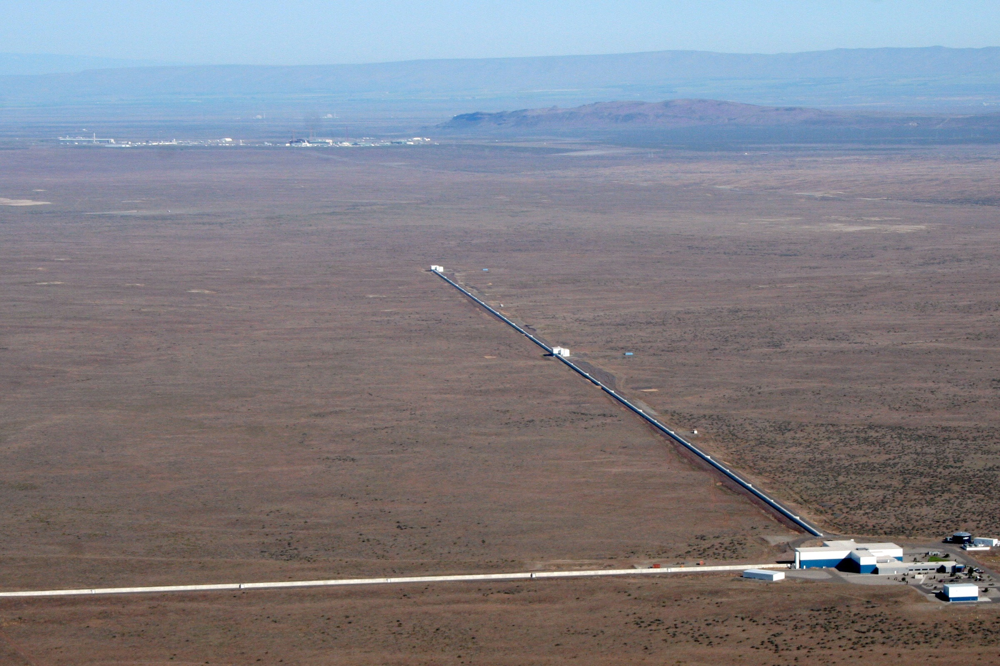
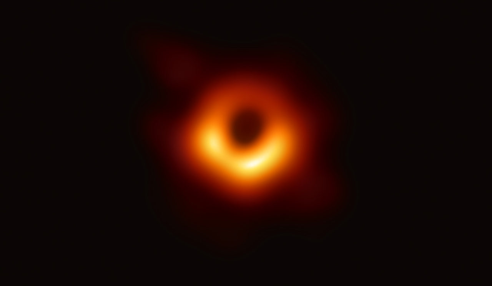
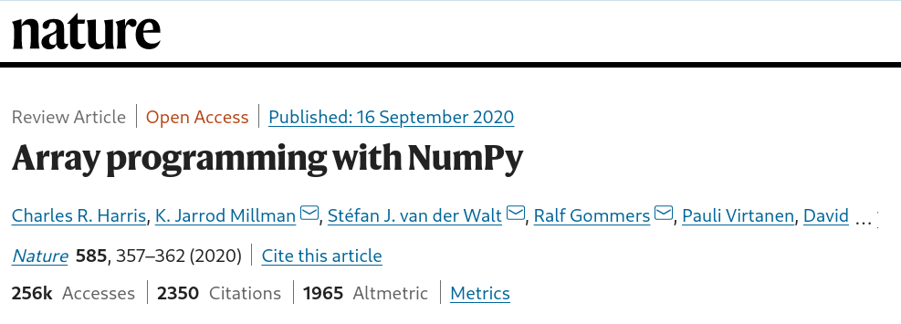
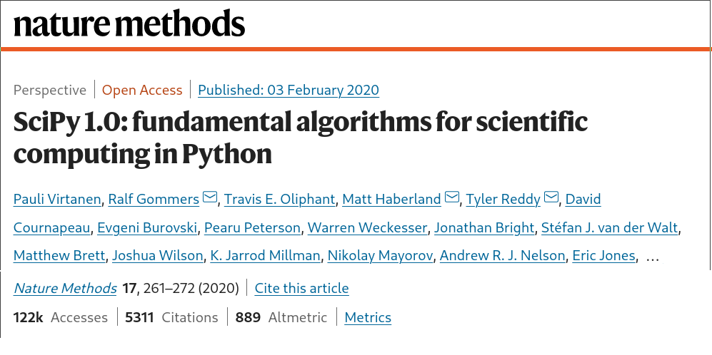

# Scientific Python

## Past, present, and future

 

Stéfan van der Walt 
University of California, Berkeley

...

## 2016: LIGO observes gravitational waves

Note:

2016
Laser Interferometer Gravitational-Wave Observatory

...

## 2019: EHT images a black hole

...

## 2021: Ingenuity takes off on Mars

Note:

2021
first powered controlled extraterrestrial flight

What do they have in common? Each has pipelines that utilize the Scientific Python ecosystem.
In this talk, I'd like to discuss why this is so special, how we got here, and what lies on the road ahead.

---

## Wait, what do you do again?

Note:

Your story of how you got involved in Scientific Python.

...

 

...

> Cesium is an end-to-end machine learning platform for time-series, from calculation of features to model-building to predictions. Cesium has **two main components** - a **Python library**, and a **web application platform** that allows interactive exploration of machine learning pipelines. Take control over the workflow in a Python terminal or Jupyter notebook with the Cesium library, or upload your time-series files, select your machine learning model, and watch Cesium do feature extraction and evaluation right in your browser with the web application.

Note:

Importantly: non-regularly sampled time-series

...

Naul, B., Bloom, J.S., Pérez, F. et al. A recurrent neural network for classification of unevenly sampled variable stars. Nat Astron 2, 151–155 (2018). https://doi.org/10.1038/s41550-017-0321-z

...

## SkyPortal

...

## Fritz

...

## Fritz

...

## Wait, what do you do again?

A little bit of everything.

Note:

The applied mathematician's dream.

---

## Where were we...

...

## What makes Scientific Python special?

- Who developed the software
- When, and with what?

...

...

### Philosophy

http://nipy.org/nipy/mission.html#nipy-mission

> We believe that neuroscience ideas and analysis ideas develop
> together.
> Good ideas come from understanding; understanding comes
> from clarity, and clarity must come from well-designed teaching
> materials and well-designed software.
> The software must be designed
> as a natural extension of the underlying ideas.
>     --- Matthew Brett, 2007 for NiPy

---

## External 3.3 (Image)

---

## External 3.4 (Math)

`\[ J(\theta_0,\theta_1) = \sum_{i=0} \]`
