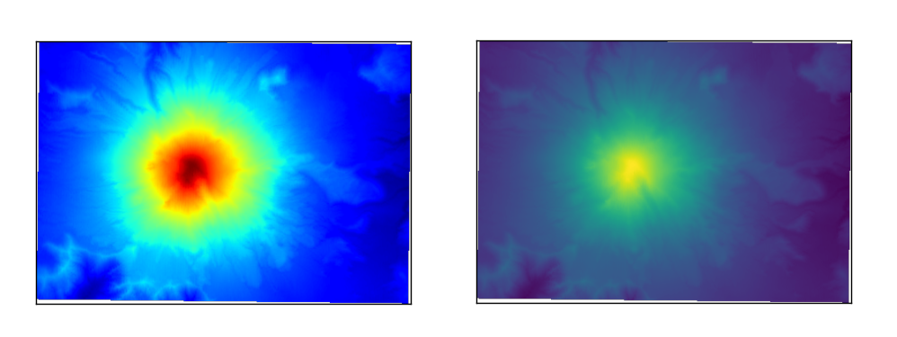
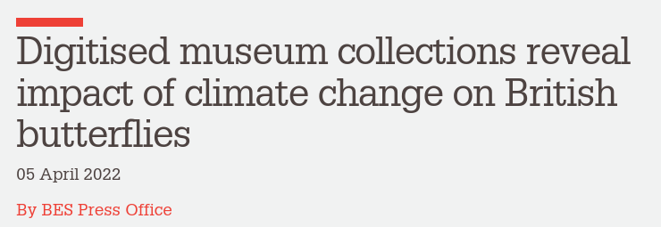
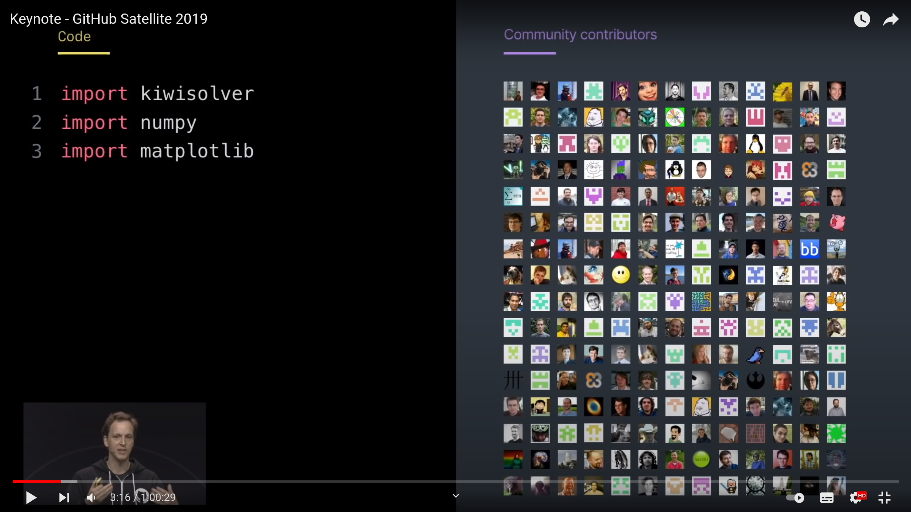

 Scientific Python

## Past, future, present

 

Stéfan van der Walt 
University of California, Berkeley

...

## 2016: LIGO observes gravitational waves

GW150914

Notes:

- 2016
- first direct detection of gravitational waves from merger of 2 black
holes
- Laser Interferometer Gravitational-Wave Observatory, Hanford and Livingston
- confirmed a proposal by Poincaré and major prediction of Einstein's 1915 general theory of relativity
- work earned Rainer Weiss, Kip Thorne, and Barry Barish a Nobel Prize in Physics
...

## 2019: EHT images a black hole

Notes:

Event Horizon Telescope Collaboration
First ever image of a black hole through Very Long Baseline Interferometry

...

## 2021: Ingenuity takes off on Mars

Notes:

2021
first powered controlled extraterrestrial flight

What do they have in common? Each has pipelines that utilize the Scientific Python ecosystem.
In this talk, I'd like to discuss why this is so special, how we got here, and what lies on the road ahead.

---

## A quick introduction

Notes:

Your story of how you got involved in Scientific Python.

...

## What I do

❤️ Scientific Python

Problem ➡  Tool use ➡  Joy & frustration & 💡 ➡  Tool development

Notes:

Fortunate position to now devote the majority of my time to SP.

Me to dad: How do you learn to program? Well, you need a problem.

Some of us got a bit stuck on the last bit.

...

...

 

...

> Cesium is an end-to-end machine learning platform for time-series, from calculation of features to model-building to predictions. Cesium has **two main components** - a **Python library**, and a **web application platform** that allows interactive exploration of machine learning pipelines. Take control over the workflow in a Python terminal or Jupyter notebook with the Cesium library, or upload your time-series files, select your machine learning model, and watch Cesium do feature extraction and evaluation right in your browser with the web application.

Notes:

Importantly: non-regularly sampled time-series

...

Naul, B., Bloom, J.S., Pérez, F. et al. A recurrent neural network for classification of unevenly sampled variable stars. Nat Astron 2, 151–155 (2018). https://doi.org/10.1038/s41550-017-0321-z

...

## SkyPortal

...

## Fritz

...

## Fritz

...

## So what do you do?!

A little bit of everything...

- Passionate about tool building
- But to build good tools you need to use them

Notes:

The applied mathematician's dream.

---

<!-- Section: success of SP -->

## Scientific & engineering advances

Notes:

- Three major recent advances
- What do they have in common -> pipelines use SP
- This is just a small selection

...

...

...

...

Notes:

Really big corps are now using us to sell their product.

GitHub: Nate's talk with our faces in background

Emphasizing that importing these libraries is essentially broadening
your developer team, "giving them commit access to your project".

...

Notes:

US govt probably spent a billion dollars on it...

... but it's all based on free software.

...

## Teaching Python

At Berkeley, at least:

- Computer Science
- Data Science
- Information School
- Neuroimaging

... to name a few.

Notes:

In the beginning, we could not even find rooms on campus to teach
this.  Still, had several workshops, bootcamps, etc.

Now, it is ubiquitous.

This is no longer unusual, not only at UCB.

(Teaching, in itself, does not mean the tools are good for science,
but there's a practical element to it, namely...)

Students are equipped with Python by the time they arrive in research.

...

Use of Scientific Python is pervasive

It is being used in novel and leading science

It is continually improving, growing, responding to needs

Notes:

NumPy, e.g., stable, what could you want to change about it.
But we are refactoring the whole data type system.

Despite this, poorly funded, mainly driven by volunteers outside of
their main jobs.

Very few people are rewarded for working on this (sometimes quite the contrary).

...

The Scientific Python ecosystem of libraries
is **critical research infrastructure**.

Notes:

- Research is becoming more data-dependent.
- Research therefore cannot happen without software.
- Research software relies on *reliable* computational libraries.

In some ways, software is becoming what math used to be for research.
Lots of training for math, but very little for scientific software development.

Software is the instrument with which we see data.
The way we express our thoughts and reasoning about the world as
investigative instruments.

---

## Adoption

### Why is widespread adoption of SP ecosystem unusual?

Consider:

- Who developed the software
- When, and with what?

Notes:

- Small handful of students, junior researchers, other volunteers
- Predominantly in their spare time, over weekends and evenings
- Often little to no financial support
- Against wishes / recommendations of many colleagues (not Ben!)

Competing against platforms built by companies with:

- Millions of dollars in funding
- Hundreds of dedicated programmers
- Pushes by big marketing teams, contracts with many corporations and universities

...

## Why is SP successful?

📜 Principles
🚜 Practices
🤸🏿 People

...

## Principles

- Scientific software must be community developed, and community owned
- This is the best way to align incentives for doing good quality, transparent, reproducible science

Notes:

- We believe that researchers know their needs best
- Their ideas must be surfaced and integrated into the computational
  platform as efficiently as possible
- In this endeavor, making money for shareholders is at best a
  distraction
  - But often, it incentivises entirely the wrong things: hardware
    locks, license servers, closed file formats
  - Incentive to lock users into  proprietary systems
    - This prohibits sharing, reproducibility, and transparency

- Transparency: you *should* always be able to investigate the
  *entire* scientific stack.
- To know answers are accurate, you have to be able to look under the
  hood.
- You also need to be able to modify tools to do *new things*, to do
  *whatever* needs to be done.
- The change required is bigger than just open software; you need
  reproducible research as well (i.e. data/methods publishing). But
  it's a start.

...

## Principles (II)

**The important of language and library choices cannot be underestimated.**

> We believe that ~neuroscience~ ideas and analysis develop
> together.
> Good ideas come from understanding; understanding comes
> from clarity, and clarity must come from well-designed teaching
> materials and well-designed software.
> The software must be designed
> as a natural extension of the underlying ideas.
>
> — NiPy mission statement 
http://nipy.org/nipy/mission.html

Notes:

- Re-emphasises the notion of a user-developer
- Library interfaces and language clarity / expressivity matter: it's
  how we express our thoughts.

...

## Practices

None of this matters if we cannot rely on the answers.

#### At core: deliberate practice

**Examples**

Technical:

- Revision control
- Testing / continuous integration
- Code review
- Documentation
- Iteration

Social:

- Governance (*see also:* people)

Notes:

No matter how sound philosophy, we still need working code!

<!-- Code review both during development cycle, but also during use where
users can easily introspect for problems. -->

<!-- Documentation has to stay in sync with code (docstrings). -->

...

...

## People

> Healthy communities are built when everyone's voice is heard, when
> their perspective is valued, and when their work is recognized.
>
> https://scientific-python.org/about

Work done in collaboration is better and more fun—depending on the people.

- **Community** is meaningful.
- **Culture** is important for good work.
- **Leadership** sets direction.
- **Governance** sets expectations and reduces misunderstandings.

Notes:

- Community

  - Many of my best friends I made through this ecosystem.

  - These have been the most fulfilling and educational collaborations
    of my life.

  - Being part of a movement where everyone is aligned is incredibly
    exciting.

  - For me, personally, it's been transformative to my career. Lots of
    people have helped me get where I am today.

- Culture

  - In a volunteer effort you cannot afford *not* to treat people
    well

  - Unsurprisingly, when people feel welcome, listened to, engaged, they produce
    better work

- Leadership

  - It helps greatly when the founders of projects set the right tone;
    one of the things that drew me into SP from the beginning

    - Various projects had you earn your badge
    - SP phone call from Berkeley: trust placed in newcomers,
      welcomed with open arms, treated with respect (listen to opinions)

---

## Challenges

- Developer time (review time)
- A lot of time-consuming training (GSoC, etc.)

 

- Funding
- Implications of receiving funding (see: NumPy circa 2018)
- Coordination / cross-project decision making
- Unified user experience

Notes:

- Developer time
  - Very few full time like me
  - Contributor time varies (also: parents, breadwinners, etc.)

- We are doing a lot of training
  - Academia and industry both often use us to train people
  - That should be taught in universities / as professional courses

- Funding
  - No grant line items
  - Few company contributions
  - Mostly foundation-supported
    - Some grants, but need more and *longer term*

- Coordination
  - Used to be small (SciPy conf), now big
  - Nothing like project managers who can think about whole ecosystem,
    get user feedback, set up roadmaps, etc.
  - Coordination is haphazard

...

> The **Scientific Python project** aims to better coordinate the
> ecosystem and grow the community.

Immediate goals:

1. Coordinate
2. Get projects funded
3. Support & develop shared infrastructure
4. Foster the next generation of contributors

...

### Coordinate projects

https://scientific-python.org/specs

Notes:

- Coordinate projects
  - SPECs (like PEPs, high level, endorsed by "core")
    - SPECs also allow for younger projects to propose ideas
  - Venues for discussion
    - Discourse forum
    - Virtual technical meetings
  - Watch ecosystem, identify pain points, and coordinate response
    - Like developer meetings (currently virtual)
  - Eventually again have an annual developer meeting

...

## Get projects funded

Notes:

- Get projects funded

  - Decadal dev plan (evidence of need)
  - Workshops on grant writing
  - Funding is crucial for increased participation (via,
    e.g. full-time paid roles)

...

## Support & develop shared infrastructure

Notes:

  - Tools used across ecosystem such as numpydoc
  - Community calendars
  - Standard web themes for core projects
  - Common discussion forums
  - Developer statistics dashboard
  - Benchmarking
  - Analytics

BTW, a little easter egg on the NumPy frontpage to try!

...

## Support & develop shared infrastructure

...

## Support & develop shared infrastructure

...

## Foster the next generation of contributors

- https://blog.scientific-python.org
- https://twitter.com/scientific_py
- https://tinyurl.com/scientific-python-youtube
- https://discuss.scientific-python.org

Notes:

  - Make it easy for new contributors to join the project
  - Social media
    - Onboarding
    - Dev interviews
    - SP library examples
  - Learn: material for users, contributors, maintainers
  - Blog: informal
  - Discourse discussion forum

...

## The people behind this effort

\+ &nbsp; `  {accessiblity, spec, theme, blog, ...} teams`

---

## What can you do?

...

## Support

- Contribute or support students who want to
- Reward and recognize efforts outside of paper writing
- Fund open, not closed software (and convince the NRF to do the
  same!)
- Apply lessons from SP to your work
  1. Test research code
  2. Executable papers (AKA automate everything)
  3. Collaborate widely, credit all those involved
  4. Insist on open code & data (reviewing and publishing)

*Developing open source scientific practice*, K. Jarrod Millman & Fernando Pérez 
See https://www.jarrodmillman.com/oss-chapter.html

...

### Benefits for Contributors

- Advance science
- Make an impact
- Grow as a developer
- Shape the tools you use

You are very welcome to join!

...

### Learn more

#### Website: https://scientific-python.org

Has links to:

- Blog: https://blog.scientific-python.org
- Twitter: https://twitter.com/scientific_py
- YouTube: https://tinyurl.com/scientific-python-youtube
- Discourse: https://discuss.scientific-python.org

---

## With thanks to

- Ben Herbst
- School for Data Science and Computational Thinking
- Praelexis
- Stellenbosch University

Email: stefanv@berkeley.edu
 
Web: https://scientific-python.org
